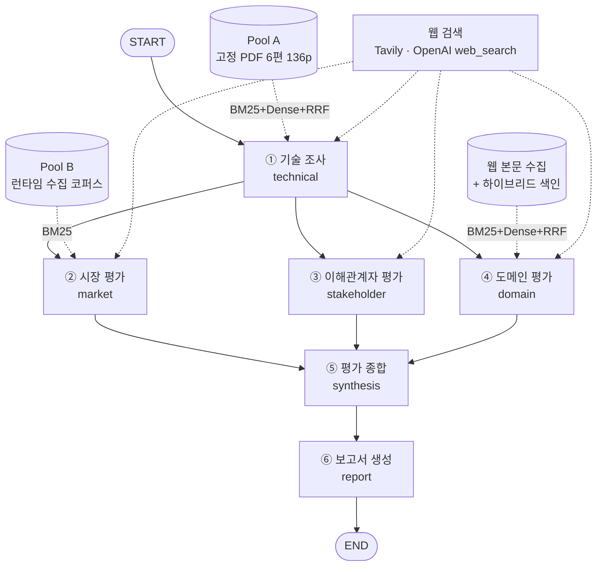

# Subject

본 프로젝트는 KV cache 최적화 기술을 소프트웨어, 하드웨어 두 진영에서 선정하여,
시장·이해관계자·도메인 관점에서 평가하는 Agentic RAG를 개발하는 프로젝트 임.

여섯 개의 에이전트가 각자 근거를 수집해 판단하고, 관점끼리 서로의 결론을 보지 않은 채
평가한 뒤, 마지막에 대조·종합하여 하나의 보고서로 만듭니다. 우열을 매기는 것이 목적이
아니라 "어떤 조건에서 적합한가"를 근거와 함께 남기는 것이 목적입니다.

---

## Overview

- **Objective** : 하나의 기술을 복수 관점에서 비교 평가. 순위·점수를 만들지 않고, 관점별
  판정과 그 판정이 성립하는 조건, 판단하지 못한 공백(gap)을 함께 기록한다.
- **Method** : Multi-Agent(Distributed) + Agentic RAG. LangGraph 부모 그래프 하나에 여섯
  에이전트를 노드로 연결하고, 세 평가 관점(시장·이해관계자·도메인)은 병렬로 실행한다.
  에이전트는 각자 검색·수집·검증을 따로 구현하며, 공유하는 것은 State 스키마와 근거 형식뿐이다.
- **Tools** : Tavily Search/Extract(웹 검색·본문 추출), OpenAI Responses `web_search`(이해관계자),
  pdfplumber(PDF 파싱), rank-bm25 + FAISS + BGE-M3(하이브리드 검색), reportlab(PDF 보고서 출력)

---

## Selected Technologies

| | 기술 | 출처 | 접근 방식 |
|---|---|---|---|
| **SW** | DeepSeek-V2 Multi-head Latent Attention (MLA) | arXiv:2405.04434v5 | `model_architecture_kv_compression` |
| **HW** | ITME: Inference Tiered Memory Expansion | arXiv:2606.12556v2 | `cxl_hybrid_tiered_memory` |

- **SW : DeepSeek-V2 MLA** — 어텐션 구조에서 Key-Value를 저차원 잠재 표현으로 압축해 KV cache
  총량 자체를 줄이는 접근입니다. 양자화·축출(eviction) 계열과 달리 모델 구조를 바꾸는 방식이라
  SW 진영의 대표 사례로 골랐고, 원논문이 측정 조건과 함께 정량 수치를 공개하고 있어 근거 검증이
  가능합니다.
- **HW : ITME** — CXL-hybrid 계층 메모리로 데이터센터의 KV 상태 저장 공간을 GPU HBM 밖으로
  확장하는 접근입니다. SW가 "KV를 줄인다"면 HW는 "KV를 둘 자리를 늘린다"로, 같은 병목을 정반대
  방향에서 다루기 때문에 비교 대상으로 삼았습니다.

두 기술은 `agents/technical/config.py`의 `DEFAULT_SELECTED_TECH`에 고정돼 있고, 다른 기술명으로
바꾸면 기술 조사 에이전트가 실패 결과를 반환합니다. 평가 도메인도 `datacenter`로 고정했습니다 —
CXL은 랙 스케일 인터커넥트 규격이라 온디바이스·엣지에는 존재하지 않아, 그 환경을 도메인으로
잡으면 HW 기술은 평가 자체가 성립하지 않기 때문입니다.

**수치 인용 규칙.** 원논문 수치는 반드시 측정 조건과 함께 써야 하며, 조건 없는 인용은 코드 검사가
차단합니다. 예를 들어 93.3%(KV cache 감소)는 DeepSeek 67B 대비 **모델 전체** 비교이지 MLA 단독
효과가 아니고, 5.76×(생성 처리량)는 8×H800 조건이며, 35.7%(처리량 향상)는 CPU-offload 대비
**최대값** 표기가 필요합니다.

---

## Features

- **PDF 자료 기반 정보 추출** — Pool A 고정 코퍼스(arXiv 논문 6편, 136페이지)를 저장소에 포함해
  `data/technical/sources/`에 두고, 문서별 SHA-256을 매니페스트로 고정합니다. pdfplumber 기본
  설정에서는 단어 사이 공백이 사라져(`Inthepastfewyears…`) BM25 토크나이저가 무력화되는 문제가
  있어 `x_tolerance`를 3에서 1.5로 낮췄습니다.
- **웹 검색 기반 근거 수집** — 시장·이해관계자·도메인은 고정 문서 풀이 아니라 공신력 있는 웹
  출처에서 근거를 모읍니다(Tavily Search/Extract, OpenAI web_search).
- **출처 등급 필터** — paper / patent / standard / vendor / news 다섯 등급표에 없는 도메인은
  채택하지 않고, 기각 사유를 검색 로그에 남깁니다. 검색 API의 도메인 필터는 신뢰하지 않습니다
  (`include_domains`에 13개를 지정했는데 medium·substack·youtube가 그대로 반환된 사례가 있습니다).
  도메인 접미사만 보면 `forums.developer.nvidia.com`이 벤더 공식 자료로 분류되므로 `forums.`,
  `community.` 같은 서브도메인을 먼저 걸러냅니다.
- **결정적 근거 ID와 멱등 병합** — 정규화한 URL + locator + 인용문을 SHA-256으로 해시해
  `<agent>:ev:<hash>` 형식의 ID를 만듭니다. 같은 자료를 재시도로 다시 가져와도 같은 ID가 나오고,
  `evidence_store`는 리스트가 아니라 dict + reducer라서 여러 관점이 같은 출처를 찾아도 한 벌만
  남습니다.
- **인용 원문 검증** — LLM이 "이 문장이 근거"라고 지목한 인용문이 실제 수집 본문에 문자열로
  존재하는지 대조하고, 없으면 그 근거를 통째로 버립니다.
- **TRL 판정은 코드가 수행** — LLM은 구현물 수준·검증 환경·활동 같은 관측만 구조화하고, TRL
  1~9 Gate는 코드가 순서대로 계산합니다. API 공개·GitHub 코드·제품 판매는 단독으로 TRL 7 이상을
  만들 수 없습니다.
- **하이브리드 검색** — 짧은 문서는 그대로 근거 후보로 쓰고, 긴 논문만 청킹해 BM25 + dense +
  RRF로 관련 조각만 골라냅니다. 전체 본문을 프롬프트에 넣지 않습니다.
- **관점별 품질 검사** — 시장은 코드 rubric, 도메인은 단일 프롬프트 self_check, 평가 종합은
  C1~C7 결정적 검사 + 위반 문장 1회 재생성, 보고서는 결정적 validator + 부분 수정(최대 2회)으로
  서로 다르게 구현돼 있습니다(설계 의도와 트레이드오프는 각 `docs/*_AGENT.md`에 기록).
- **보고서 자동 생성** — SUMMARY부터 REFERENCE까지 16개 섹션을 조립하고 A4 PDF로 출력합니다.
  본문에서 실제 인용된 근거만 REFERENCE에 올라갑니다.
- **실행 추적** — 노드마다 소요 시간·갱신 키·중간 결과를 `outputs/graph/<실행시각>/`에 남겨,
  중간에 멈춰도 그때까지의 결과를 확인할 수 있습니다.

### 확증 편향 방지 전략

평가가 한쪽으로 쏠리는 경로를 단계별로 막았습니다.

- **관점 격리** — 각 에이전트의 `node.py`가 `project_input()`으로 필요한 키만 추립니다. 다른
  관점의 결과(`market_findings` 등)는 프롬프트에 넣지 않으므로, 먼저 끝난 관점의 결론이 다음
  관점을 물들이지 않습니다. 공통 입력은 기술 조사 요약뿐입니다.
- **질문을 쌍으로 생성** — 기대 효과를 묻는 질문과 제약·실패 조건을 묻는 질문을 반드시 짝으로
  만듭니다. 한쪽만 만들면 검색 결과부터 한쪽으로 쏠립니다.
- **반대 근거 필수** — 시장 평가는 기술마다 counter 근거가 최소 1건 없으면 `complete`로 올리지
  않고 미완료로 남깁니다.
- **반대 근거 재귀속 검사** — ITME 논문 초록을 넣었을 때 "비교 대상(기존 DPU 오프로딩)의 한계"를
  ITME 자신의 한계로 옮겨 적는 사례가 나왔습니다. 그래서 `stance=counter` 근거만 별도 LLM 호출로
  "이 한계의 주어가 대상 기술 자신인가"를 다시 판정합니다(요약문은 주지 않고 원문 인용만 보여줍니다).
- **우열 어휘 차단** — 우수·더 낫·승자·추천·권장·압도·우위·열위·월등 같은 표현을 종합·보고서
  단계에서 검사해 걸러냅니다.
- **근거 불균형 감시** — 기술별 근거 수(중복 제거)가 2배 이상 차이 나면 한계점에 기록합니다.
- **제시 순서 고정** — 입력 순서와 무관하게 `sw → hw`, `technical → market → stakeholder →
  domain`으로 정렬해 순서 편향을 없앱니다.
- **부재를 없음으로 쓰지 않음** — 제한된 공개 검색에서 근거를 찾지 못했을 때 "상용화되지 않았다"가
  아니라 "공개 근거에서 확인하지 못했다"로 기록하고, `not_found`를 실제 부재로 일반화하는 문장은
  보고서 검사가 차단합니다.
- **모르는 것은 unknown으로** — 근거가 없으면 추정으로 메우지 않고 `assessment=unknown`과 `gaps`로
  남깁니다. 실험 환경과 데이터센터 환경의 차이는 `conditions`에 따로 적어, 조건이 다른 비교가
  종합 단계에서 섞이지 않게 합니다.
- **이해관계자 편향 플래그** — 발언자 이름·소속에 대상 기술명이 들어 있으면 "자기 홍보일 수 있음"
  표시를 붙입니다.

---

## Tech Stack

- **Framework** : LangGraph 1.x (StateGraph, 병렬 fan-out/fan-in, reducer), LangChain 1.x
- **LLM/Generator** : 에이전트마다 다릅니다(아래 표). 하나로 통일할지는 팀 결정 사항입니다([ISSUE.md](ISSUE.md) 2-3).
- **LLM/Judge** : 단일 judge 모델을 두지 않고, 코드로 답할 수 있는 검증은 코드가, 문맥 판단이
  필요한 것만 LLM이 맡습니다(아래 표).
- **Retrieval** : BM25(rank-bm25) + Dense(FAISS + BGE-M3) + RRF 하이브리드
- **Embedding** : `BAAI/bge-m3` (MIT, 8192 토큰) — 오픈소스 임베딩만 사용

### 에이전트별 모델과 검증 방식

| 에이전트 | Generator | 검증(Judge) 방식 |
|---|---|---|
| ① 기술 조사 | `gpt-4.1-nano` (관측 구조화) | 코드 — TRL Gate 연속 충족 계산, 인용 원문 대조, 수치·baseline 검사 |
| ② 시장 평가 | `gpt-4.1-mini` (계획·판정) | 코드 rubric(6칸 충분/부분/부족) + `gpt-4.1` 반대 근거 재귀속 재검증 |
| ③ 이해관계자 평가 | `gpt-4.1-mini` (Responses `web_search`) | 규칙 기반 편향 플래그, 누락 조합 1회 재검색 |
| ④ 도메인 평가 | `gpt-4o` (판정·주장·self_check 단일 호출) | 프롬프트 내 self_check + 코드 참조 무결성 검사 |
| ⑤ 평가 종합 | `gpt-4.1` (서술) | 코드 C1~C7 중립성 검사, 위반 문장 1회 재생성 후 제거 |
| ⑥ 보고서 생성 | `gpt-4o-mini` (섹션 작성) | 결정적 validator(인용·수치·목차·REFERENCE), 위반 섹션만 최대 2회 부분 수정 |

### 검색 방식 비교 (Golden Set 16문항, 청크 213개)

| 방식 | Hit@1 | Hit@3 | Hit@5 | MRR | 평균 지연 | 피크 메모리 |
|---|---|---|---|---|---|---|
| BM25 | 0.562 | 0.625 | 0.688 | 0.606 | 0.2ms | 0.0MB |
| dense (bge-m3) | **0.875** | **0.875** | **0.875** | **0.875** | 35.3ms | 0.1MB |
| hybrid (RRF) | 0.812 | 0.875 | 0.875 | 0.833 | 33.7ms | 0.1MB |

재현: `python -m agents.domain.tools.ablation --cache data/fetch_cache --embedding BAAI/bge-m3`

MRR만 보면 dense 단독이 하이브리드보다 앞섭니다(0.875 대 0.833). 그럼에도 하이브리드를 쓰는
이유는 질의 언어가 섞이기 때문입니다. 평가 질문은 한국어로 생성되는데 근거 문서는 영어라,
교차언어 구간에서 키워드 검색이 무너집니다.

| 방식 | 한국어 질의 Hit@5 | 영어 질의 Hit@5 |
|---|---|---|
| BM25 | 0.29 (2/7) | **1.00** (9/9) |
| dense (BAAI/bge-m3) | **0.86** (6/7) | 0.89 (8/9) |

영어 질의에서는 BM25가 dense보다 낫기 때문에 한쪽을 버리면 그 구간이 손해입니다. 이 측정
결과를 반영해 질문 생성 프롬프트에 "질문의 절반 이상을 영어로 쓰라"는 지시를 넣었습니다.

### 임베딩 모델 선정

| 후보 | 라이선스 | 최대 입력 | 검토 결과 |
|---|---|---|---|
| **BAAI/bge-m3** | MIT | 8192 토큰 | **선정** — 긴 논문 청크를 자르지 않고 담고, 교차언어 검색이 됨 |
| intfloat/multilingual-e5-large | MIT | 512 토큰 | 논문 청크가 자주 잘림 |
| nlpai-lab/KURE-v1 | MIT | 512 토큰 | 한국어 특화, 영어 논문 검색에 불리 |
| sentence-transformers/all-MiniLM-L6-v2 | Apache-2.0 | 256 토큰 | 영어 전용, 한국어 질의 불가 |

---

## Agents

여섯 에이전트는 서로를 import하지 않습니다. 각자 `make_node()` 하나만 밖으로 내보내고, 그 안에서
내부 형식을 부모 State 형식으로 변환합니다.

| # | 에이전트 | 하는 일 | 주요 출력 키 |
|---|---|---|---|
| ① | **기술 조사** `agents/technical` | Pool A 고정 PDF RAG + Tavily로 기술 성숙도를 조사하고, 코드가 TRL 1~9 Gate를 계산 | `technical_findings`, `evidence_store` |
| ② | **시장 평가** `agents/market` | 시장 규모·성장성, 상용화·채택, 생태계 지지를 웹 검색 + Pool B 런타임 코퍼스로 조사 | `market_findings`, `evidence_store`, `search_log_by_perspective` |
| ③ | **이해관계자 평가** `agents/stakeholder_eval.py` | 기술 2개 × 그룹 4개(경쟁 진영/운영자·서빙 엔지니어/공급사/투자자)의 실제 발언을 찾아 지지·반대·중립으로 분류 | `stakeholder_findings`, `evidence_store` |
| ④ | **도메인 평가** `agents/domain` | 데이터센터 요구사항 6축 × 기술 2개 = 12개 판정을, 웹 검색 + 하이브리드 RAG 근거로 생성 | `domain_findings`, `evidence_store`, `quality_by_perspective`, `run_meta` |
| ⑤ | **평가 종합** `agents/synthesis` | 네 관점 결과를 처음으로 한자리에 모아 비교 매트릭스·상충(SX1~SX7)·보완 관계를 만듦. 새 검색을 하지 않고 관점별 판정을 고쳐 쓰지 않음 | `synthesis` |
| ⑥ | **보고서 생성** `agents/report` | 확정 State를 섹션별 최소 payload로 나눠 LLM이 서술하고, 인용 연결·REFERENCE·PDF는 코드가 담당 | `report_sections`, `references`, `quality_by_perspective`, `retries`, `run_meta` |

**④ 도메인 평가의 요구사항 6축** — HBM 용량 압박 완화 / 처리량(tokens/s)과 동시 요청 수 /
지연시간(TTFT·TPOT) / 정확도 유지 / 전력·발열 / 인프라 도입 비용과 운영 부담. 근거가 전혀 없는
조합도 `assessment=unknown` 레코드로 남겨, 축을 놓친 것인지 판단을 보류한 것인지 구분되게 합니다.

**⑤ 평가 종합의 상충 규칙** — SX1 증거 수준, SX2 범위(기술군 vs 대상 기술), SX3 조건 탈락,
SX4 수치 차이(10% 초과), SX5 시점 차이(12개월 초과), SX6 같은 근거의 반대 stance, SX7 TRL 입력
불일치.

---

## Architecture



①이 먼저 실행되고 ②③④는 같은 단계에서 병렬로 실행되며 서로의 결과를 보지 않습니다. 세 결과가
모두 모인 뒤 ⑤가 실행되고, `evidence_store`는 이 지점에서 reducer(`merge_evidence_store`)로
합쳐집니다. 엣지는 `graph/build.py`에만 있고, 노드 조립과 실행은 `main.py`가 담당합니다.

에이전트별 내부 흐름 다이어그램은 [`outputs/agent-architecture/`](outputs/agent-architecture/)에
PNG·SVG·Mermaid 원본으로 있습니다(전체 8장). 실행할 때마다 LangGraph가 그린 실제 구조가
`outputs/graph/<실행시각>/graph.mmd`로도 저장됩니다.

### 공유 State 계약

에이전트가 공유하는 것은 `graph/state.py`의 `AppState` 하나뿐입니다.

- 각 노드는 **자기 소유 키만** 부분 업데이트로 반환합니다(`return {"domain_findings": ...}`).
  병렬 노드가 같은 키를 동시에 쓰면 에러가 납니다.
- 두 개 이상의 노드가 쓰는 키에는 reducer를 붙입니다(`evidence_store`, `quality_by_perspective`,
  `search_log_by_perspective`, `run_meta`).
- 근거·주장 ID에는 에이전트 이름을 접두사로 붙입니다(`domain:claim:001`, `market:ev:<hash12>`).
- 관점 결과는 모두 `PerspectiveFindings`(records / claims / gaps / limitations /
  input_evidence_ids) 형식으로 맞춥니다.
- LLM·검색 클라이언트 같은 런타임 객체는 State가 아니라 `make_node()` 인자로 주입합니다.
- 실패해도 예외를 밖으로 던지지 않고 `status`를 `partial`·`failed`로 표시한 뒤 이유를
  `gaps`/`errors`에 담아 반환합니다.

상세 설계는 [`docs/STATE_DESIGN.md`](docs/STATE_DESIGN.md), 폴더 규칙은
[`디렉터리 구조 설명.md`](디렉터리%20구조%20설명.md)에 있습니다.

---

## Directory Structure

```
Capstone_Ai_RAG/
├── graph/                      ★ 팀 공유 영역 (여기만 공유)
│   ├── state.py                AppState, reducer, create_initial_state
│   ├── build.py                add_node / add_edge 만
│   └── stubs.py                fixture 재생 임시 노드 (오프라인 실행용)
│
├── agents/                     에이전트별 구현 (서로 import 하지 않음)
│   ├── technical/              ① 기술 조사 — Pool A RAG + Tavily + TRL Gate
│   ├── market/                 ② 시장 평가 — 웹 검색 + Pool B (rag/, quality/)
│   ├── stakeholder_eval.py     ③ 이해관계자 평가 — 단일 파일, OpenAI web_search
│   ├── domain/                 ④ 도메인 평가 — 웹 검색 + 하이브리드 RAG (tools/)
│   ├── synthesis/              ⑤ 평가 종합 — matrix/relations/writer/review
│   └── report/                 ⑥ 보고서 생성 — writer/validators/references/pdf
│
├── data/                       문서 풀과 캐시
│   ├── technical/sources/      Pool A 고정 코퍼스 (arXiv PDF 6편, 136p)
│   ├── technical/manifest.json 문서 ID·SHA-256·역할 고정
│   ├── search_cache/           검색 질의 캐시 (git 제외)
│   └── fetch_cache/            수집 본문 캐시 (git 제외)
│
├── scripts/                    에이전트 단독 실행 (python -m scripts.run_<이름>)
├── tests/                      에이전트별 오프라인 테스트 (API 키 없이 실행)
├── docs/                       에이전트별 설계 문서, State 설계
├── outputs/                    실행 산출물, 아키텍처 다이어그램
├── main.py                     부모 그래프 실행 진입점
├── requirements.txt            통합 의존성
├── .env.example                API 키 템플릿
├── ISSUE.md                    팀 이슈 트래킹
└── README.md
```

프롬프트 템플릿은 별도 `prompts/` 폴더가 아니라 **각 에이전트 폴더 안**에 둡니다
(`agents/<이름>/prompts.py`). 한 에이전트의 구현을 전부 자기 폴더 안에 두어 다른 에이전트와
독립적으로 수정·테스트할 수 있게 하기 위해서입니다. 실행 스크립트도 `app.py`가 아니라
루트의 `main.py`입니다.

---

## Usage

모든 명령은 저장소 루트에서 실행합니다. Python 3.10 이상이 필요합니다.

### 0. 환경 설정 (처음 한 번)

```bash
python3 -m venv .venv
source .venv/bin/activate          # Windows: .venv\Scripts\activate
pip install -r requirements.txt
```

가볍게 오프라인 테스트만 할 거라면 아래로 충분합니다(sentence-transformers·torch를 받지 않아 빠릅니다).

```bash
pip install langgraph pydantic httpx openai beautifulsoup4 rank-bm25 pdfplumber reportlab pytest
```

실제 API를 호출하려면 키를 넣습니다. `.env`는 git에 올라가지 않습니다.

```bash
cp .env.example .env
# OPENAI_API_KEY=sk-...     LLM 사용 에이전트 공통
# TAVILY_API_KEY=tvly-...   기술 조사·시장·도메인 웹 검색
```

### 1. 전체 파이프라인 실행

```bash
python main.py                          # 전부 오프라인 (API 키 불필요, 비용 없음)
python main.py --live synthesis         # 평가 종합만 실제 LLM
python main.py --live all --debug       # 여섯 노드 전부 실제 실행 + 단계별 중간 결과 (비용 발생)
```

| 옵션 | 내용 |
|---|---|
| `--live` | 실제로 실행할 노드(쉼표 구분): `all` 또는 `technical`, `market`, `stakeholder`, `domain`, `synthesis`, `report` |
| `--debug` | 노드가 끝날 때마다 주장·공백·요약 문장·위반 샘플까지 출력 |
| `--rounds` | 시장·도메인의 최대 검색 라운드 1 또는 2 (기본 1) |
| `--as-of` | 조사 기준일 (기본 2026-09-22) |
| `--fixture` | 재생 노드가 쓸 AppState JSON |
| `--output-dir` | 결과 폴더 (기본 `outputs/graph`) |
| `--no-pdf` | PDF를 만들지 않음 |

기본 실행은 합성 fixture를 재생해 **API 비용 없이 배선만** 확인합니다. 재생 노드가 하나라도
있으면 결과에 "실제 조사가 아님" 경고가 붙습니다.

### 2. 결과물 (`outputs/graph/<실행시각>/`)

| 파일 | 내용 |
|---|---|
| `report.pdf` / `report.md` | 최종 보고서 (16개 섹션 + REFERENCE) |
| `summary.md` | 실행 경로, 노드별 소요 시간·갱신 키·오류, 공통 State 요약 |
| `steps/<단계>_<노드>.json` | 노드별 중간 결과 전체 |
| `final_state.json` | 실행이 끝난 AppState 전체 |
| `trace.json` | 노드 실행 기록 |
| `graph.mmd` | LangGraph가 그린 실제 그래프 구조 (Mermaid) |

### 3. 에이전트 단독 실행

```bash
python -m scripts.run_technical                      # 기술 조사 (Tavily + gpt-4.1-nano)
python -m scripts.run_market --rounds 1              # 시장 평가 (--offline 로 키 없이 배선 확인)
python -m scripts.run_domain                         # 도메인 평가 (--model, --embedding, --offline)
python -m scripts.run_synthesis --writer openai      # 평가 종합 (생략 시 템플릿 서술, 비용 없음)
python -m scripts.run_report --fixture --deterministic   # 보고서 (API 없이 fixture 재현)
```

이해관계자 에이전트는 단독 스크립트 없이 `main.py --live stakeholder` 또는
`from agents.stakeholder_eval import make_node`로 실행합니다.

### 4. 테스트 (API 키 없이 실행, 비용 없음)

```bash
python -m pytest tests --ignore=tests/agents/report/test_report_llm_integration.py   # 139개, 키 불필요
python -m unittest tests.graph.test_parent_graph -v       # 부모 그래프 15개
python -m unittest tests.agents.synthesis.test_synthesis -v   # 평가 종합 42개
```

`python -m pytest tests`로 전부 돌리면 보고서 LLM 연동 테스트 1개가 추가로 실행돼 실제 API
비용이 발생합니다. 키가 없으면 그 1개만 skip되고 나머지 139개는 그대로 통과합니다.

| 대상 | 테스트 수 | 확인하는 것 |
|---|---|---|
| 부모 그래프 | 15 | 실행 순서(①→②③④ 병렬→⑤→⑥), 키 소유, 병렬 근거 병합, PDF 출력 |
| 기술 조사 | 8 | 고정 입력 변조 거부, 연속 TRL Gate, 인용 결합, 검색 2라운드 한도 |
| 시장 평가 | 25 | 근거 ID 결정성, rubric 6종, 출처 등급 필터, Pool B 청킹·예산, 입력 격리 |
| 이해관계자 | 7 | 검색 계획 생성, 편향 플래그, 누락 재검색, State 변환 |
| 도메인 평가 | 24 | 근거 ID·병합, 출처 정책, 참조 무결성, AppState 변환, 관점 격리 |
| 평가 종합 | 42 | 매트릭스, SX1~SX7 탐지, C1~C7 검사, 입력 순서 무관성 |
| 보고서 | 18 + 1 | 목차·인용·수치·REFERENCE 계약 6케이스, LLM 연동(키 있을 때만) |

### 5. 검색 방식 비교 실험

```bash
python -m agents.domain.tools.ablation --embedding BAAI/bge-m3   # 세 방식 모두
python -m agents.domain.tools.ablation --embedding ""            # BM25만 (빠름)
```

처음 실행하면 논문 원문과 임베딩 모델을 내려받습니다. 결과는 `outputs/domain/ablation.json`입니다.

---

## Evaluation

2026-09-22 `python main.py --live all --debug` 전체 실행 기록입니다(여섯 노드 모두 실제 API).

| step | 노드 | 소요 시간 | 상태 | 결과 |
|---|---|---|---|---|
| 1 | technical | 86.4초 | partial | 판정 9칸, 주장 9개, 공백 8개 — Tavily 검색 실패로 근거 0건 |
| 2 | market | 30.4초 | partial | 판정 6칸, 공백 8개 — 직접 근거 부족 |
| 2 | stakeholder | 75.2초 | complete | 판정 8칸, 주장 23개, 근거 19건 |
| 2 | domain | 120.9초 | partial | 판정 12칸, 주장 12개, 근거 16건, 공백 2개(전력·발열, 도입 비용) |
| 3 | synthesis | 21.5초 | partial | 매트릭스 35칸, 상충 18건, 요약 주장 8개 |
| 4 | report | 95.5초 | needs_review | 16개 섹션, 참고문헌 12건, 위반 25건 |

전체 5분 30초, 공유 `evidence_store` 35건, PDF 생성까지 완료됐습니다. 실행 경로는 설계대로
`START → technical → market + stakeholder + domain → synthesis → report → END`였고, 노드 레벨
오류는 없었습니다.

`needs_review`와 `partial`은 실패가 아니라 검사가 작동한 결과입니다. 기술 조사의 Tavily 검색이
실패해 근거 0건으로 끝났고, 그 부실이 뒤로 전파돼 보고서 단계에서 "본문에 없는 evidence ID 참조"
위반으로 잡혔습니다. 근거가 없으면 없다고 표시하고 멈추지 않는 것이 설계 의도입니다.

### 재현성

`agents/domain/tools/manifest.py`가 실행마다 LLM provider·모델 ID·temperature·프롬프트 버전,
임베딩 모델·device·precision·차원, OS·CPU·RAM·torch 백엔드, 패키지 버전, 산출물 SHA-256,
git commit을 기록합니다. 검색 질의는 `data/search_cache/`에, 수집 본문은 `data/fetch_cache/`에
남아 `TAVILY_API_KEY` 없이도 같은 자료로 재생할 수 있습니다(캐시는 git에 올라가지 않습니다).

다만 완전한 재현은 되지 않습니다. 질의 계획을 매 실행 LLM이 새로 만들기 때문에 검색되는 자료가
실행마다 달라지고, LLM 서술도 고정되지 않습니다.

---

## Limitations

- **관점별 LLM이 통일되지 않았습니다.** 에이전트마다 다른 모델을 쓰고 있어 비용·품질 비교가
  어렵습니다([ISSUE.md](ISSUE.md) 2-3).
- **평가 도메인을 데이터센터로 고정**했으므로 "온디바이스에서는 MLA가 더 유리하다" 같은 반대
  방향 평가는 담기지 않습니다.
- **단일 프롬프트 자체 검증의 일관성이 코드 검증보다 낮습니다.** 도메인 에이전트는 품질 검사를
  결정적 코드 3종에서 단일 프롬프트로 통합했는데, 같은 파이프라인이라도 프롬프트 문구에 따라
  위반 탐지가 "완전히 놓침 → 과잉 반응(10건 오탐) → 적절히 발견(3건)"으로 크게 흔들렸습니다
  (경위는 [`docs/DOMAIN_AGENT.md`](docs/DOMAIN_AGENT.md)).
- **이해관계자 에이전트는 원문 재검증을 하지 않습니다.** 코드 가독성을 위해 인용문 대조 검증을
  뺐으므로, 중요한 판단에는 `evidence_store`의 URL을 직접 확인해야 합니다.
- **평가 종합의 상충 규칙에 오탐이 남아 있습니다.** SX7은 실제 데이터에서 거의 항상 걸리고,
  SX6은 문서 단위로 잘못 걸립니다([ISSUE.md](ISSUE.md) 6-1, 6-2).
- **Golden Set이 16문항**이라 한 문항이 검색 지표의 0.06을 좌우합니다.
- 코드 검사로 잡을 수 없는 오류(문장의 뜻이 근거와 다른 경우)가 남으므로, 보고서를 쓰기 전에
  사람이 요약 주장과 근거를 대조해야 합니다.

전체 이슈 목록과 진행 상태는 [ISSUE.md](ISSUE.md)에서 관리합니다.

---

## Documents

| 문서 | 내용 |
|---|---|
| [`docs/PARENT_GRAPH.md`](docs/PARENT_GRAPH.md) | 부모 그래프 구조, 노드별 연결 상태, 실행 옵션 |
| [`docs/STATE_DESIGN.md`](docs/STATE_DESIGN.md) | 공유 State(AppState) 설계 |
| [`docs/TECHNICAL_AGENT.md`](docs/TECHNICAL_AGENT.md) | ① 기술 조사 — TRL Gate 규칙, 출력 계약 |
| [`docs/MARKET_AGENT.md`](docs/MARKET_AGENT.md) | ② 시장 평가 — Pool B, rubric, 반대 근거 재검증 |
| [`docs/STAKEHOLDER_EVAL_AGENT.md`](docs/STAKEHOLDER_EVAL_AGENT.md) | ③ 이해관계자 평가 — 5단계 흐름, 단순화 트레이드오프 |
| [`docs/DOMAIN_AGENT.md`](docs/DOMAIN_AGENT.md) | ④ 도메인 평가 — 도메인 고정 근거, 임베딩 측정, 품질 검증 전환 |
| [`docs/SYNTHESIS_AGENT.md`](docs/SYNTHESIS_AGENT.md) | ⑤ 평가 종합 — 상충 규칙 SX1~SX7, 검사 C1~C7 |
| [`docs/REPORT_AGENT.md`](docs/REPORT_AGENT.md) | ⑥ 보고서 생성 — 섹션 계약, 인용·REFERENCE 규칙 |
| [`docs/TECHNICAL_AGENT_DECISIONS.md`](docs/TECHNICAL_AGENT_DECISIONS.md) | 기술 조사 설계 판단 기록 |
| [`docs/REPORT_domain_section.md`](docs/REPORT_domain_section.md) | 팀 보고서용 도메인 관점 초안 |
| [`디렉터리 구조 설명.md`](디렉터리%20구조%20설명.md) | 폴더 규칙, 에이전트 추가 체크리스트, 브랜치·PR 규칙 |
| [`ISSUE.md`](ISSUE.md) | 팀 이슈 트래킹 |

---

## Contributors

| 담당 | 이름 | 주요 작업 |
|---|---|---|
| 공유 State · 부모 그래프 | | `graph/state.py`, `graph/build.py`, `main.py`, 노드 통합·이슈 관리 |
| 강유성 ① 기술 조사 에이전트 | | Pool A 코퍼스 구축, 하이브리드 검색, TRL Gate 판정 |
| 이효은 ② 시장 평가 에이전트 | | Pool B 런타임 수집, 출처 등급 필터, rubric 판정, 반대 근거 재검증 |
| 지승환 ③ 이해관계자 평가 에이전트 | | OpenAI web_search 기반 발언 수집, 편향 플래그, 아키텍처 다이어그램 |
| 이산 ④ 도메인 평가 에이전트 | | 웹 검색 RAG, 임베딩·검색 방식 비교 실험, 요구사항 축별 판정 |
| 안균승 ⑤ 평가 종합 에이전트 | | 비교 매트릭스, 상충 규칙 SX1~SX7, 중립성 검사 C1~C7 |
| 이동영 ⑥ 보고서 생성 에이전트 | | 섹션별 LLM 서술, 인용·REFERENCE 검증, PDF 출력 |
