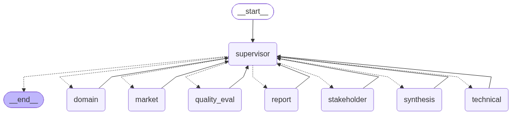

# Subject

본 프로젝트는 KV cache 최적화 기술을 소프트웨어, 하드웨어 두 진영에서 선정하여,
기술 성숙도·시장·이해관계자·도메인 관점에서 평가하는 **Supervisor 패턴** 기반 멀티 에이전트를 설계/개발하는 프로젝트 임.

우열을 매기는 것이 목적이 아니라 "어떤 조건에서 적합한가"를 근거와 함께 남기는 것이 목적이다.
RAG 과제 단계의 상세 설명(검색 실험, 에이전트별 판정 규칙 등)은 [docs/RAG_README.md](docs/RAG_README.md)에 있다.

## Overview

- **Objective** : 하나의 기술을 복수 관점에서 비교 평가. 관점별 판정과 그 판정이 성립하는 조건, 판단하지 못한 공백(gap)을 함께 기록
- **Pattern** : **Supervisor** — 관점 에이전트의 결과 품질(근거 충분도)이 실행마다 달라, 결과를 점검한 뒤 다음 행동(재조사·종합·재작성)을 정하는 중앙 판단이 필요했다.
  Orchestrator-Workers는 사전 계획을 한 번에 펼쳐 실행하므로 "근거가 모자란 관점만 다시 조사"하는 흐름을 표현하기 어렵다.
- **동적 처리** : 고정 순서(`technical → 3관점 → synthesis → report`)를 없앴다. supervisor가 매 단계 State를 읽어
  - 근거가 부족한 관점만 재작업시키고(충분한 관점은 그대로 통과),
  - 관점 결과가 바뀌면 synthesis·report를 stale로 보고 다시 실행하며,
  - 품질 평가가 미달이면 원인 관점(잘못된 인용의 출처 에이전트) 재작업 또는 피드백을 반영한 보고서 재작성을 고른다.
  - 실제 live 실행(2026-10-07)에서 market·stakeholder만 재작업, 품질 평가 후 domain 재작업이 일어났다(LangSmith 트레이스 참고).

## Selected Technologies

- **SW : DeepSeek-V2 Multi-head Latent Attention (MLA)** (arXiv:2405.04434) — 어텐션 구조에서 KV를 저차원 잠재 표현으로 압축해 KV cache 총량을 줄인다.
  양자화·축출과 달리 모델 구조를 바꾸는 SW 대표 사례이며, 원논문이 측정 조건과 함께 정량 수치를 공개해 근거 검증이 가능하다.
- **HW : ITME (Inference Tiered Memory Expansion)** (arXiv:2606.12556) — CXL-hybrid 계층 메모리로 KV 저장 공간을 GPU HBM 밖으로 확장한다.
  SW가 "KV를 줄인다"면 HW는 "KV를 둘 자리를 늘린다" — 같은 병목을 반대 방향에서 다뤄 비교 대상으로 삼았다.

## Features

- **PDF 자료 기반 정보 추출** — Pool A 고정 코퍼스(arXiv 6편, 136p)를 SHA-256 매니페스트로 고정, BM25+Dense+RRF 하이브리드 검색
- **웹 근거 수집** — Tavily(기술·시장·도메인), OpenAI `web_search` + 원문 HTML 대조(이해관계자)
- **근거-주장 결합 검증** — 이해관계자 인용문은 원문 block·해시·날짜·수치를 코드로 대조, 도메인 주장은 인용 원문에 없는 수치를 제외하고 gap으로 기록
- **확증 편향 방지 전략**
  - 관점 격리: 각 관점은 다른 관점의 결론을 입력으로 받지 않는다(공통 입력은 기술 조사 요약뿐)
  - 기대 효과·제약을 묻는 질문을 쌍으로 생성, 반대 근거(counter) 필수 확인
  - 섹션 분량 선별 시 SW·HW를 번갈아 고르고 기술마다 반대 근거 1건을 먼저 확보
  - 근거 부재는 "없다"가 아니라 "공개 근거에서 확인하지 못했다"로 기록
- **보고서 품질 평가 (Hybrid, 3안)** — 실험으로 역할을 나눴다([docs/QUALITY_EVAL.md](docs/QUALITY_EVAL.md))

  | 평가 항목 | 코드 검사 | LLM Judge (gpt-4.1) |
  |---|---|---|
  | Groundedness | 사실 문장 인용률 ≥ 0.8, 무인용 수치 0건, 보고서 수치·인용 검증 위반 0건 | 수치 문장 ↔ 인용 근거 원문 대조(뒷받침 여부) |
  | 중립성 | 우열·추천 금지어 | 금지어 없는 암묵적 추천 탐지 |
  | 편향 통제 | 전체·섹션별 단일 출처 비중(>0.8 실패), SW/HW 인용 균형, 한 기술만 다룬 관점 | — (보고서 통째 채점 실험에서 4개 모델 모두 탐지 실패) |
  | 관점 커버리지 | 4.1~4.4 섹션 존재·인용·실질 내용 | — (동일) |

  미달이면 supervisor가 피드백과 함께 재작업을 요청한다(Loop, 보고서 최대 2버전).
- **보고서 10장 제한** — 섹션별 분량 예산 + 제출본 인용 번호화(`[n]`, 코드가 REFERENCE 순서로 계산) + PDF 장수 가드

## Tech Stack

- **Framework** : LangGraph 1.2 (StateGraph, conditional edges, MemorySaver), LangChain 1.4, LangSmith tracing
- **LLM/Supervisor** : gpt-4.1 (규칙이 계산한 허용 행동 안에서만 선택, 위반 시 규칙 기본값으로 대체)
- **LLM/Generator** : 에이전트별 — 기술 조사 gpt-4.1, 시장 gpt-4.1-mini(+gpt-4.1 재검증), 이해관계자 gpt-5-mini, 도메인 gpt-4o, 평가 종합 gpt-4.1, 보고서 gpt-4o-mini
- **LLM/Judge** : gpt-4.1 (보고서 생성 모델 gpt-4o-mini와 분리, 5종 결함 변형 × 4개 모델 실험으로 선정)
- **Retrieval** : BM25 + FAISS(Dense) + RRF — Hit@5 0.875, MRR 0.833 (Golden Set 16문항, 청크 213개)
- **Embedding** : BAAI/bge-m3 (오픈소스, 8192 토큰, 교차언어 검색)

## Agents

- **Supervisor** (`graph/supervisor.py`) : 규칙이 State에서 허용 결정 집합(예산·상한·의존성 반영)과 기본값을 계산 → LLM이 그 안에서 선택 → guard가 검증.
  근거 충분도(근거 ≥ 3건, 판정 coverage ≥ 0.5)를 평가해 부족 관점에 재작업을 지시하고, 충분하거나 부족 상태가 수용된 뒤에만 보고서로 진행
- **① 기술 조사** (`agents/technical`) : Pool A RAG + Tavily, TRL 1~9 Gate는 코드가 계산
- **② 시장 평가** (`agents/market`) : 시장 규모·상용화·생태계, 출처 등급 필터, 반대 근거 재귀속 검증
- **③ 이해관계자 평가** (`agents/stakeholder`) : 기술 × 그룹 발언을 원문 대조 후 지지·반대·중립 분류
- **④ 도메인 평가** (`agents/domain`) : 데이터센터 요구사항 6축 × 기술 2개 판정
- **⑤ 평가 종합** (`agents/synthesis`) : 비교 매트릭스·상충(SX1~SX7)·보완 관계, 중립성 검사(C1~C7)
- **⑥ 보고서 생성** (`agents/report`) : 서술은 LLM, 표·인용·REFERENCE·수치 조건은 코드. 근거 밖 인용 ID 제거, 위반이 남은 섹션은 결정적 렌더로 대체
- **⑦ 품질 평가** (`agents/quality`) : 위 Hybrid 평가, 근거가 뒷받침하지 못한 주장을 출처 관점 재작업으로 라우팅

## State Schema

`graph/state.py`의 `SupervisorState`(제어 메타) ⊃ `AppState`(관점 결과 계약). 에이전트 내부 State는 각 에이전트 서브그래프에 따로 있다(Layered).

- **제어 vs 페이로드 분리** : 라우팅은 `node_status`·`rework`·`step_count`·`next`만 읽는다. 관점 결과(`*_findings`)는 supervisor가 충분도 계산에만 읽고 수정하지 않는다
- **관측성 위치** : 결정 전체 로그는 State 밖 `outputs/graph/<run>/decisions.jsonl`(`{trace_id, step, decision, reason, source, ts}`). State엔 `last_decision` 1건만. LangSmith run metadata에 `trace_id`
- **지속성 비용** : 보고서 Markdown·PDF는 파일로 쓰고 State엔 `artifacts`의 경로만. 원문 본문은 fetch_cache, 결정 로그는 JSONL. `last_decision`은 덮어써 체크포인트마다 커지지 않는다
- **상관** : `trace_id` = checkpoint `thread_id` = LangSmith metadata/tag = decisions.jsonl 키
- **재개/복구** : `node_status`(attempts·completed_step·last_error)와 `rework`(created_step으로 1회 소비)만 있으면 supervisor가 다음 행동을 재계산. `MemorySaver` 체크포인터 연결. 워커 예외는 `failed`로 기록되고 그래프는 계속된다
- **동시 처리** : 병렬 워커가 함께 쓰는 키는 reducer — `evidence_store`(ID 기준 멱등 병합), `node_status`·`artifacts`·`quality_by_perspective`·`search_log_by_perspective`·`run_meta`(dict 병합). 나머지는 노드별 소유
- **종료 보장** : `step_count ≥ max_steps`면 강제 종료, 관점당 재작업 1회, 보고서 최대 2버전, 보고서 상한 도달 시 추가 재작업 없이 종료. LLM 제안은 이 상한 안의 선택지로만 제한된다

## Architecture



모든 워커의 유일한 출구는 supervisor(실선)이고, supervisor의 분기(점선)는 `add_conditional_edges`로 State에서 계산된다.
market·stakeholder·domain은 같은 superstep에 병렬로 디스패치될 수 있다.

## Directory Structure

```
├── agents/                 # 하위 에이전트 (서로 import 하지 않음, 프롬프트는 각 폴더의 prompts.py)
│   ├── technical/          # ① 기술 조사
│   ├── market/             # ② 시장 평가
│   ├── stakeholder/        # ③ 이해관계자 평가 (원문 검증형)
│   ├── domain/             # ④ 도메인 평가
│   ├── synthesis/          # ⑤ 평가 종합
│   ├── report/             # ⑥ 보고서 생성 (분량 예산·수치 조건·PDF)
│   └── quality/            # ⑦ 품질 평가 (Hybrid)
├── graph/                  # 조정 계층
│   ├── state.py            # SupervisorState / AppState / reducer
│   ├── supervisor.py       # 허용 결정 계산 + LLM 선택 + guard
│   ├── workers.py          # 워커 래퍼 (재작업 지시 주입, 예외 격리, 산출물 파일화)
│   ├── build.py            # 그래프 토폴로지
│   └── decision_log.py     # decisions.jsonl
├── data/                   # 문서 풀 (Pool A 고정 PDF, 캐시)
├── scripts/                # 에이전트 단독 실행, judge 실험
├── tests/                  # 오프라인 테스트 (API 키 불필요)
├── docs/                   # 설계 문서 (SUPERVISOR_PLAN, QUALITY_EVAL, 에이전트별)
├── outputs/                # 실행 결과, 아키텍처 그림, judge 실험 결과
├── main.py                 # 실행 스크립트
└── README.md
```

## Usage

```bash
pip install -r requirements.txt
cp .env.example .env        # OPENAI_API_KEY, TAVILY_API_KEY, LANGSMITH_API_KEY
```

```bash
python main.py                                   # 전부 오프라인 (fixture 재생, 비용 없음)
python main.py --live all --supervisor llm       # 실제 실행 + LangSmith 트레이싱
python -m pytest tests -q --ignore=tests/agents/report/test_report_llm_integration.py
```

결과는 `outputs/graph/<실행시각>/`에 `report.pdf`, `report.md`, `decisions.jsonl`, `summary.md`(라우팅 경로), `final_state.json`으로 남는다.

## Contributors

| 이름 | 수행 역할 |
|---|---|
| 강유성 | ① 기술 조사 에이전트(Pool A 코퍼스·하이브리드 검색·TRL Gate), Supervisor·State 설계, 보고서 분량 예산, 품질 평가 Hybrid 설계·judge 실험 |
| 이효은 | ② 시장 평가 에이전트(출처 등급 필터, rubric 판정, 반대 근거 재검증) |
| 지승환 | ③ 이해관계자 평가 에이전트(발언 수집, 편향 플래그), 아키텍처 다이어그램 |
| 이산 | ④ 도메인 평가 에이전트(웹 검색 RAG, 임베딩·검색 방식 비교 실험) |
| 안균승 | ⑤ 평가 종합 에이전트(비교 매트릭스, 상충 규칙 SX1~SX7, 중립성 검사) |
| 이동영 | ⑥ 보고서 생성 에이전트(섹션 서술, 인용·REFERENCE 검증, PDF 출력) |
