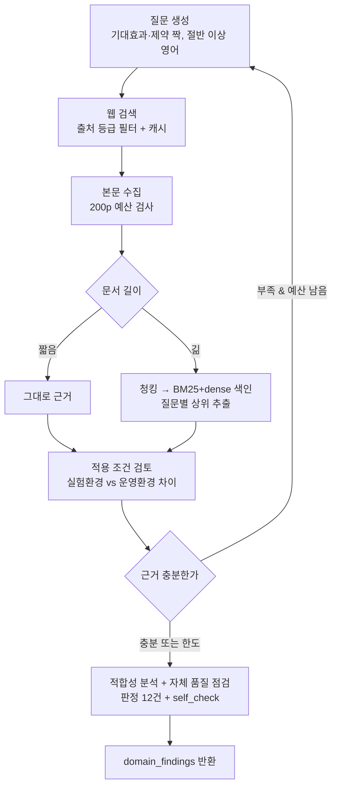

# 보고서 — 도메인 평가 에이전트 및 RAG 적용

팀 보고서에 들어갈 담당 파트입니다. 전체 보고서의 SUMMARY·REFERENCE 와 나머지 관점은
다른 담당자 분량이며, 여기서는 도메인 관점 평가와 RAG 파이프라인만 다룹니다.

---

## 1. RAG 적용 대상과 그 이유

여섯 에이전트 중 도메인 평가 에이전트를 RAG 기반으로 설계했습니다. 이 에이전트가 답해야 하는
질문이 모델의 사전 지식으로는 답할 수 없는 종류이기 때문입니다.

도메인 적합성 판단은 "기술이 무엇인가"가 아니라 "이 기술의 측정값이 어떤 조건에서 나왔고,
그 조건이 데이터센터 운영 환경과 얼마나 다른가"를 묻습니다. 적용 조건을 읽지 못하면 실험
환경과 목표 환경의 간극을 판단할 근거가 없고, 결국 논문의 주장을 그대로 옮기는 데 그칩니다.

시점 문제도 있습니다. 선정한 ITME 논문은 2026년 6월 공개 자료로 평가에 사용한 GPT 계열
모델의 학습 데이터 절단 시점 이후일 가능성이 높습니다. 마지막으로 출처 추적 의무가
있습니다. 평가 보고서는 REFERENCE 장에 실제로 활용한 자료만 기재해야 하고, 각 주장은 어떤
문서 어느 위치에서 나왔는지 연결되어야 합니다.

## 2. 문서 선정 전략

문서 풀을 사전에 고정하는 대신, 평가 질문에 따라 공신력 있는 웹 출처에서 런타임에 수집하는
방식을 택했습니다. 등급표(paper·patent·standard·vendor·news)에 없는 도메인은 근거로
채택하지 않고, 거른 이유를 검색 로그에 남깁니다. 200페이지 제한은 사전 선정이 아니라
수집 누적량으로 강제합니다.

검색 제공자의 필터는 신뢰하지 않습니다. Tavily의 `include_domains`에 신뢰 도메인을
13개 지정했더니 medium·substack·youtube가 그대로 섞여 들어왔습니다. 그래서 결과를 받은
뒤 자체 등급표로 다시 거릅니다. 도메인 접미사만으로 등급을 매겼을 때
`forums.developer.nvidia.com`이 벤더 공식 자료로 분류된 적이 있어, 포럼·커뮤니티
서브도메인은 별도로 걸러냅니다.

## 3. 임베딩 모델 선택

오픈소스 임베딩만 사용한다는 전제에서 후보를 추렸습니다.

| 후보 | 라이선스 | 최대 입력 | 검토 결과 |
|---|---|---|---|
| BAAI/bge-m3 | MIT | 8,192 토큰 | 선정 |
| intfloat/multilingual-e5-large | MIT | 512 토큰 | 논문 청크가 자주 잘림 |
| nlpai-lab/KURE-v1 | MIT | 512 토큰 | 한국어 특화, 영어 논문 검색에 불리 |
| all-MiniLM-L6-v2 | Apache-2.0 | 256 토큰 | 영어 전용, 한국어 질의 불가 |

선정 기준을 리더보드 순위로 잡지 않았습니다. 대신 우리 과업 조건(한국어 질의로 영어 문서
검색)을 그대로 재현해 직접 측정했습니다.

| 방식 | 한국어 질의 Hit@5 | 영어 질의 Hit@5 |
|---|---|---|
| BM25 (키워드) | 0.29 (2/7) | 1.00 (9/9) |
| dense (bge-m3) | 0.86 (6/7) | 0.89 (8/9) |

BM25는 한국어 질의에서 무너집니다. 겹치는 어휘가 없으니 당연한 결과입니다. 임베딩은
성능을 조금 올리는 선택지가 아니라 교차언어 검색을 성립시키는 필수 요소입니다. 동시에
영어 질의 구간에서는 BM25가 앞서므로 두 방식을 함께 쓰고, 질문 생성 프롬프트가 질의의
절반 이상을 영어로 만들도록 했습니다.

전체 비교(Golden Set 16문항, 청크 213개): BM25 MRR 0.606 / dense 0.875 / hybrid 0.833.
재현: `python -m agents.domain.tools.ablation --embedding BAAI/bge-m3`.

## 4. 도메인 관점 평가 기준

### 데이터센터를 선택한 이유

KV cache 문제의 본질은 연산 병목이 아니라 메모리 병목입니다. 데이터센터에서는 한 요청의
KV cache가 다른 사용자 몫의 HBM을 잠식해 동시 처리 요청 수를 직접 떨어뜨립니다. HW
기술인 ITME가 전제하는 CXL은 랙 스케일 규격이라 온디바이스에는 없어, SW 압축과 HW 확장이
같은 무대에서 비교되는 환경은 데이터센터가 사실상 유일합니다. 처리량·HBM 점유량·랙 전력
예산처럼 합의된 지표가 있어 주관 판단을 조건부 판단으로 환원할 수 있다는 것도 이유입니다.

### 평가 축과 판정 단위

여섯 축을 상수로 고정했습니다. 축을 매 실행마다 모델이 생성하게 두면 실행할 때마다 평가
기준이 달라져 기술 간 비교가 성립하지 않기 때문입니다.

1. HBM 용량 압박 완화 2. 처리량과 동시 요청 수 3. 지연시간(TTFT·TPOT)
4. 정확도 유지 5. 전력·발열 6. 인프라 도입 비용과 운영 부담

판정은 **요구사항 축 하나 × 기술 하나마다** 만듭니다. 6개 축 × 2개 기술 = 최대 12개
레코드이며, 실제 실행에서도 매번 정확히 12건이 생성됩니다. 판정은 열거형으로 고정합니다
(`suitable`/`conditional`/`unsuitable`/`unknown`, 근거 강도는
`direct`/`inferred`/`unknown`/`not_applicable`). 우열은 판정하지 않되, "SW는 압축률
얼마, HW는 처리량 몇 배" 같은 수치 비교 사실 서술은 허용하고 "더 우수하다", "권장한다"
같은 평가적 결론만 걸러냅니다.

## 5. State 설계 (도메인 관점)

부모 State는 팀 공통 `AppState`(`graph/state.py`) 하나입니다. 근거는 리스트가 아니라
`id`를 키로 하는 dict(`evidence_store`)로 관리해, 재시도할 때 같은 근거가 중복으로
쌓이지 않고 여러 관점이 같은 출처를 찾아도 한 벌로 병합됩니다. ID는 정규화한 URL·위치·
인용문을 해시해 결정적으로 만들어 재현 시 같은 근거가 같은 ID를 받게 했습니다.

관점별 결과는 `domain_findings`, `quality_by_perspective["domain"]`,
`search_log_by_perspective["domain"]`으로 분리해 병렬 분기에서 다른 관점과 충돌하지
않습니다. 서브그래프에 넘기는 입력도 `project_input()`으로 추려, 시장·이해관계자 관점의
중간 결론이 도메인 판단에 새지 않게 했습니다(테스트로 검증).

## 6. Graph 설계 (도메인 서브그래프)

루프는 근거 충분성 판단에서 한 번 발생하며, 검색 예산이 남아 있을 때만 질문을 바꿔
재검색합니다. 분기는 문서 길이에서 한 번 더 발생합니다 — 짧은 문서는 색인 없이 그대로
근거가 되고, 긴 문서만 청킹·색인을 거칩니다. 임베딩이 쓰이는 지점은 이 한 곳뿐입니다.

## 7. RAG 파이프라인 구현

| 단계 | 구현 | 비고 |
|---|---|---|
| 문서 수집 | `agents/domain/tools/websearch.py`, `fetch.py` | 출처 등급 필터, 타임아웃·재시도·레이트리밋 |
| 파싱 | pdfplumber (PDF), BeautifulSoup (HTML) | 페이지·문자 범위를 위치 정보로 보존 |
| 청킹 | `agents/domain/tools/index.py` | 1,200자 / 200자 겹침, 위치 정보 유지 |
| 임베딩 | BAAI/bge-m3 (오픈소스) | 긴 문서에만 적용 |
| 검색 | FAISS + BM25, RRF 융합 | 질의 유형이 둘이라 함께 사용 |
| 컨텍스트 활용 | `agents/domain/subgraph.py` | ID·짧은 인용만 전달해 프롬프트 희석 방지 |

### PDF 파싱에서 걸렸던 문제

pdfplumber 기본 설정으로 arXiv 논문을 추출하니 단어 사이 공백이 사라졌습니다.
`x_tolerance`를 기본값 3에서 1.5로 낮춰 해결했고, 표·수식이 포함된 12개 페이지를 재검수해
붙은 단어가 없음을 확인했습니다.

## 8. 품질 검증 설계: 코드 3종 → 단일 프롬프트로 통합

처음에는 결정적 `guard`(citation·수치·날짜·참조 무결성), 표현 `linter`, 별도 LLM
`judge`(coverage·neutrality)로 검증을 세 층으로 나눴습니다. 이후 팀 논의에 따라 `analyze`
노드 하나가 판정·주장·자체 품질 점검(`self_check`)을 한 번의 구조화 출력으로 내도록
단순화했습니다. 코드에 남긴 것은 참조 무결성(존재하지 않는 근거 라벨 제거) 하나뿐이며,
이는 품질 판단이 아니라 없으면 시스템이 죽는 방어적 처리입니다.

**이 단순화의 대가를 세 번의 실행으로 확인했습니다.**

- 1차 실행: 근거 하나가 경쟁 제품("Kimi K3")에 대한 기사였는데 HW(ITME) 판정에 유추
  근거로 썼습니다. 신뢰도(`inferred`/`class`)는 낮췄지만 판정 문장 자체에는 실제 대상이
  드러나지 않았고, 자체 점검도 이 문제를 놓쳤습니다(violations 0건).
- 2차 실행: 프롬프트에 "다른 제품 근거는 위반으로 표시하고 실제 대상을 명시하라"는 규칙을
  추가하자, 문제는 해결됐지만 이번엔 **정상 근거 12건 중 10건**에 "대상 불일치"가 과잉
  발동했습니다.
- 3차 실행: 규칙을 "같은 회사·같은 계열의 배경 설명은 불일치가 아니다"로 구체화하자
  위반이 10건 → 3건으로 줄었고, 남은 3건을 직접 검증한 결과 전부 실제로 타당한
  지적이었습니다(ITME가 아니라 HBM 세대 일반론·PIM이라는 다른 기술을 다룬 근거).
  1차의 문제(Kimi K3)도 이번엔 판정 문장에 실제 대상이 명시돼 해결을 확인했습니다.

결정적 코드는 느슨하든 엄격하든 실행마다 같은 기준으로 판정하지만, 단일 프롬프트 자체
점검은 규칙 문구의 미묘한 차이에 훨씬 민감하다는 것을 세 번의 실행으로 확인했습니다.
이는 팀이 감수하기로 한 트레이드오프이며, 그래서 `quality_by_perspective`의
`violations`/`warnings`는 실행마다 확인이 필요합니다.

## 9. 종합 평가 에이전트로 넘기는 데이터

산문 대신 구조화 레코드로 넘기고 세 가지를 강제합니다. 주장 1건은 한 문장(240자),
판정은 열거형 고정, 근거 본문은 ID 참조(원문은 `evidence_store`에 한 번만).

참조 방식에서 두 번 틀렸습니다. 처음에는 주장 순번으로 판정을 연결했는데 모델이 자리를
세다 어긋나 SW 판정이 HW 주장을 가리켰고, ID 자체는 유효해 "존재 여부" 검사로는 안
걸렸습니다. 지금은 모델이 직접 붙인 `claim_key`로 참조하고 기술 일치까지 검사합니다.
같은 이유로 근거 ID(해시)도 짧은 라벨(`E1`, `E2`)로 보여준 뒤 실제 ID로 환산합니다 —
해시를 그대로 인용시켰을 때 주장 전부가 근거를 인용하지 못한 적이 있습니다.

## 10. 실행 결과 (2026-09-22, 모델 gpt-4o)

| 항목 | 값 |
|---|---|
| 검색 라운드 | 2 |
| 검색 질의 | 12건 |
| 사용 페이지 | 195 / 200 |
| 수집 근거 | 31건 (paper 27 / vendor 4) |
| 생성 주장 | 12건 |
| 도메인 판정 | 12건 (6축 × 2기술) |
| 품질 상태 | needs_review (근거 부족 violations 2건, 서술 불균형 warning 1건) |
| 관점 격리 | 다른 관점 문장 누수 없음 |

14개 노트북 코드 셀은 모두 오류 없이 실행됐습니다. `domain_findings.status`는
`partial`이고 지연시간, 정확도 유지, 인프라 도입 비용 축을 Gap으로 남겼습니다.
본문 수집은 ACM·OpenReview·IEEE Xplore가
403(봇 차단)을 반환해 여러 건 실패했고, 그래프는 중단 없이 오류를 기록한 뒤 진행했습니다.

## 11. 한계

`quality_by_perspective`의 판정 일관성이 코드 검증보다 낮습니다. 8장에서 설명한 대로
같은 파이프라인이라도 프롬프트 문구와 그날의 검색 결과에 따라 위반 개수와 내용이 크게
달라집니다.

질의·검색 제공자 설정이 바뀌거나 공유 캐시를 삭제하면 결과가 달라질 수 있습니다. 하이브리드 융합 가중치를
조정하지 않았고(측정에서는 dense 단독이 MRR 기준 앞섬), Golden Set이 16문항이라 신뢰구간이
넓습니다. 평가 도메인을 데이터센터로 고정했으므로 반대 방향 평가(온디바이스 등)는 담기지
않습니다. 모든 판단은 공개 정보에 기반한 추정입니다.

## 12. 이번 작업에서 배운 것

설계가 맞는지는 돌려보기 전까지 알 수 없었습니다. 결정적 코드 검증을 단일 프롬프트로
단순화하는 결정 자체는 팀 스키마(`QualityReport`가 이미 단순한 status/violations/warnings
형태)와 잘 맞았지만, 그 실제 동작 품질은 프롬프트 문구 하나에 취약했습니다. 세 번의
실행에서 "완전히 놓침 → 과잉 반응(정상 근거 10건 오탐) → 적절히 발견(3건, 전부 타당)"으로
개선되는 과정을 실측했고, 이 과정 자체가 "왜 결정적 코드 검증은 판정이 일관되고, 단일
프롬프트 검증은 튜닝이 필요한가"를 보여주는 근거가 됐습니다.
