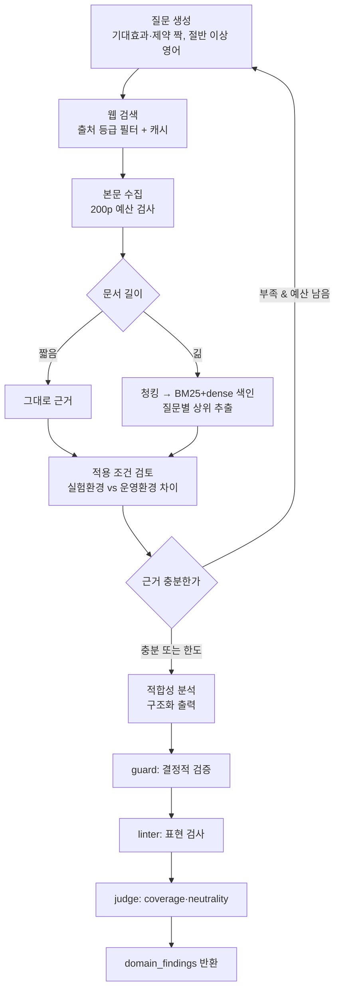

# 보고서 — 도메인 평가 에이전트 및 RAG 적용

팀 보고서에 들어갈 담당 파트입니다. 전체 보고서의 SUMMARY·REFERENCE 와 나머지 관점은
다른 담당자 분량이며, 여기서는 도메인 관점 평가와 RAG 파이프라인만 다룹니다.

---

## 1. RAG 적용 대상과 그 이유

여섯 에이전트 중 도메인 평가 에이전트를 RAG 기반으로 설계했습니다. 이 에이전트가 답해야 하는
질문이 모델의 사전 지식으로는 답할 수 없는 종류이기 때문입니다.

도메인 적합성 판단은 "기술이 무엇인가"가 아니라 "이 기술의 측정값이 어떤 조건에서 나왔고,
그 조건이 데이터센터 운영 환경과 얼마나 다른가"를 묻습니다. 예를 들어 ITME 의 처리량 1.80배는
스니펫 수준의 요약에도 나오지만, 그 수치가 어떤 모델 크기와 문맥 길이, 배치 구성에서 측정됐는지는
원문 본문에만 있습니다. 적용 조건을 읽지 못하면 실험 환경과 목표 환경의 간극을 판단할 근거가
없고, 결국 논문의 주장을 그대로 옮기는 데 그칩니다.

시점 문제도 있습니다. 선정한 ITME 논문은 2026년 6월 공개 자료로 평가에 사용한 GPT 계열 모델의
학습 데이터 절단 시점 이후일 가능성이 높습니다. 파라미터 지식에만 의존하면 존재하지 않는 수치를
만들어내거나 유사한 다른 CXL 연구와 혼동할 위험이 큽니다.

마지막으로 출처 추적 의무가 있습니다. 평가 보고서는 REFERENCE 장에 실제로 활용한 자료만
기재해야 하고, 각 주장은 어떤 문서 어느 위치에서 나왔는지 연결되어야 합니다. 검색 단계에서
출처 메타데이터를 함께 확보하지 않으면 보고서 작성 시점에 사후 복원할 방법이 없습니다.

## 2. 문서 선정 전략

문서 풀을 사전에 고정하는 대신, 평가 질문에 따라 공신력 있는 웹 출처에서 런타임에 수집하는
방식을 택했습니다. 도메인 평가는 논문 밖의 운영 맥락 — 벤더의 CXL 지원 현황, 실제 서빙 제약,
전력 예산 논의 — 을 함께 봐야 하는데, 이런 자료는 미리 목록으로 고정하기 어렵습니다.

대신 아무 웹 문서나 받지 않도록 출처 등급표를 두었습니다.

| 등급 | 대상 | 근거 강도 |
|---|---|---|
| paper | arXiv, IEEE, ACM, USENIX, OpenReview 등 | 사실 주장 가능 |
| patent | Google Patents, WIPO, USPTO | 사실 주장 가능 |
| standard | CXL Consortium, JEDEC, OCP, SNIA | 사실 주장 가능 |
| vendor | NVIDIA, Intel, AMD, Samsung, SK하이닉스 등 공식 도메인 | 사실 주장 가능 |
| news | Reuters, The Register, SemiAnalysis 등 | 추론까지만 |
| 그 외 | 등급표에 없는 도메인 | 채택하지 않음 |

등급표에 없으면 근거로 쓰지 않고, 거른 이유를 검색 로그에 남깁니다. 매체 보도만 근거인 주장은
`basis` 를 `direct_evidence` 로 올리지 않고 `inference` 로 낮춥니다.

과제의 200페이지 제한은 사전 선정이 아니라 수집 누적량으로 강제합니다. 문서를 가져온 뒤
누적 페이지가 한도를 넘기면 그 문서를 통째로 제외합니다. 실행 결과 194페이지를 사용했습니다.

### 검색 제공자의 필터를 신뢰하지 않은 이유

Tavily 의 `include_domains` 옵션에 신뢰 도메인 13개를 지정했는데, 결과에 medium·substack·
youtube 가 그대로 섞여 들어왔습니다. 도메인을 2개로 줄이면 정상 동작하는 것으로 보아 지정 개수가
늘면 필터가 느슨해지는 것으로 보입니다. 그래서 출처 정책을 검색 결과를 받은 뒤 자체적으로 다시
적용하도록 했습니다.

## 3. 임베딩 모델 선택

오픈소스 임베딩만 사용한다는 전제에서 후보를 추렸습니다.

| 후보 | 라이선스 | 최대 입력 | 다국어 | 검토 결과 |
|---|---|---|---|---|
| BAAI/bge-m3 | MIT | 8,192 토큰 | 100+ 언어 | 선정 |
| intfloat/multilingual-e5-large | MIT | 512 토큰 | 다국어 | 논문 청크가 자주 잘림 |
| nlpai-lab/KURE-v1 | MIT | 512 토큰 | 한국어 특화 | 영어 논문 검색에 불리 |
| all-MiniLM-L6-v2 | Apache-2.0 | 256 토큰 | 영어 전용 | 한국어 질의 불가 |

선정 기준을 리더보드 순위로 잡지 않았습니다. 범용 벤치마크 상위권이라는 사실은 이 과업에서
잘 동작한다는 보장이 아니기 때문입니다. 대신 우리 과업 조건을 그대로 재현해 직접 측정했습니다.

이 에이전트는 평가 질문을 한국어로 생성하는데 근거 문서는 영어입니다. 질의와 문서의 언어가
다른 상태에서 검색이 성립하는지가 관건이었습니다. 선정 논문 두 편을 색인하고 Golden Set
16문항(한국어 7·영어 9)으로 측정했습니다.

| 방식 | 한국어 질의 Hit@5 | 영어 질의 Hit@5 |
|---|---|---|
| BM25 (키워드) | 0.29 (2/7) | 1.00 (9/9) |
| dense (bge-m3) | 0.86 (6/7) | 0.89 (8/9) |

BM25 는 영어 질의에서 완벽하지만 한국어 질의에서 무너집니다. 한국어 질의와 영어 문서 사이에
겹치는 어휘가 없으니 당연한 결과입니다. 반면 BGE-M3 는 언어에 관계없이 고르게 동작합니다.
100개 이상 언어를 단일 벡터 공간에 학습해 교차언어 정렬을 직접 겨냥한 모델이기 때문입니다.
8,192 토큰 입력 한도 역시 표와 수식이 섞인 긴 청크를 자르지 않아 유리했습니다.

즉 이 과업에서 임베딩은 성능을 조금 올리는 선택지가 아니라, 교차언어 검색을 성립시키는
필수 요소입니다. 동시에 영어 질의 구간에서는 BM25 가 앞서므로 두 방식을 함께 씁니다.
이 측정 결과를 반영해 질문 생성 프롬프트가 질의의 절반 이상을 영어로 만들도록 했습니다.
영어 질의는 웹 검색 품질과 키워드 검색 적중률을 동시에 올립니다.

### 전체 비교 (Golden Set 16문항, 청크 213개)

| 방식 | Hit@1 | Hit@3 | Hit@5 | MRR | 평균 지연 | 피크 메모리 |
|---|---|---|---|---|---|---|
| BM25 | 0.562 | 0.625 | 0.688 | 0.606 | 0.2ms | 0.0MB |
| dense (bge-m3) | 0.875 | 0.875 | 0.875 | 0.875 | 35.3ms | 0.1MB |
| hybrid (RRF) | 0.812 | 0.875 | 0.875 | 0.833 | 33.7ms | 0.1MB |

예상과 달랐던 부분이 있습니다. 하이브리드가 dense 단독보다 MRR 이 낮습니다. RRF 융합이 BM25 의
약한 상위 결과를 끌어올리면서 1순위 정확도를 깎은 것으로 보입니다. 그럼에도 하이브리드를 유지한
이유는 질의 언어가 섞이기 때문입니다. 영어 질의만 놓고 보면 BM25 가 1.00 으로 dense(0.89)보다
높아 한쪽을 버리면 그 구간이 손해입니다. 융합 가중치 조정은 남은 과제로 둡니다.

## 4. 도메인 관점 평가 기준

### 데이터센터를 선택한 이유

KV cache 문제의 본질은 연산 병목이 아니라 메모리 병목입니다. 문맥이 길어질수록 저장해야 할
Key-Value 가 선형으로 늘어 가속기의 HBM 용량을 소진하는데, 이 압박이 실제 비용으로 환산되는
곳이 데이터센터입니다. 온디바이스에서는 단일 사용자가 자기 메모리를 쓰고 끝나지만,
데이터센터에서는 한 요청이 붙잡은 KV cache 가 다른 사용자 몫의 HBM 을 잠식하고 동시 처리
가능한 요청 수를 직접 떨어뜨립니다.

두 번째는 비교 가능성입니다. HW 기술인 ITME 는 CXL 기반 disaggregated memory 를 전제합니다.
CXL 은 랙 스케일 인터커넥트 규격이라 온디바이스나 엣지에는 존재하지 않고, 그 환경을 도메인으로
잡으면 HW 진영 기술은 평가 자체가 성립하지 않습니다. SW 압축과 HW 메모리 확장이 같은 무대에서
비교되는 환경은 데이터센터가 사실상 유일합니다.

세 번째는 평가 지표가 정량적으로 존재한다는 점입니다. 처리량, 동시 요청 수, HBM 점유량,
랙 전력 예산, 토큰당 비용처럼 이미 합의된 지표가 있어 주관 판단을 조건부 판단으로 환원할 수
있습니다.

### 평가 축

여섯 축을 상수로 고정했습니다. 축을 매 실행마다 모델이 생성하게 두면 실행할 때마다 평가 기준이
달라져 두 기술 간 비교가 성립하지 않기 때문입니다. 모델에게는 각 축을 충족하는 조건만 판단하게
합니다.

1. HBM 용량 압박 완화 — 요청당 KV cache 점유가 동시 처리 요청 수를 제한
2. 처리량과 동시 요청 수 — 멀티테넌시에서 GPU 1대가 감당하는 요청 수가 단가를 결정
3. 지연시간(TTFT·TPOT) — SLA 만족 여부, 메모리 계층 이동의 전송 지연
4. 정확도 유지 — 압축률 상승 시 품질 손실 허용 범위
5. 전력·발열 — 랙 단위 전력 예산, 메모리 확장의 추가 전력
6. 인프라 도입 비용과 운영 부담 — 기존 서버 즉시 적용 가능 여부

### 판정 형식

판정은 자유 서술이 아니라 열거형으로 고정합니다. 적합성은 `suitable`·`conditional`·
`unsuitable`·`unknown` 중 하나이고, 각 주장의 근거 강도는 `direct_evidence`·`inference`·
`unknown` 중 하나입니다. 종합 단계가 값만 보고 관점 간 상충 지점을 기계적으로 찾을 수 있게
하기 위함이며, 동시에 "근거를 찾지 못했다"는 판단 보류를 실패가 아닌 정상 출력으로 취급하려는
목적도 있습니다.

우열은 판정하지 않습니다. 다만 비교 사실 자체를 막으면 보고서가 공허해지므로,
"SW 는 93.3% 감소, HW 는 1.80배 향상" 같은 수치 비교는 허용하고 "더 우수하다", "권장한다",
"압도적이다" 같은 평가적 결론만 표현 린터가 차단합니다.

### 확증편향 방지

검색 질문을 기대 효과를 묻는 것과 제약·실패 조건을 묻는 것으로 짝지어 생성하게 했습니다.
한쪽만 만들면 검색 결과도 한쪽으로 쏠립니다. 근거가 부족하면 추정으로 메우지 않고 `unknown` 과
`gaps` 로 남기며, 실험 환경과 데이터센터 환경의 차이는 별도 필드에 기록해 조건이 다른 비교가
종합 단계에서 이루어지지 않게 합니다.

## 5. State 설계 (도메인 관점)

근거를 리스트에 누적하지 않고 `evidence_store` 라는 dict 로 관리합니다. 리스트에 계속 더하는
방식은 재시도할 때마다 같은 근거가 중복으로 들어가고, 여러 관점이 같은 출처를 찾았을 때 같은
자료가 여러 벌 남습니다.

키가 되는 `evidence_id` 는 출처 신원에서 결정적으로 유도합니다. 정규화한 URL, 문서 내 위치,
정규화한 인용문을 이어 SHA-256 으로 해시합니다. 같은 자료를 다시 가져와도 같은 ID 가 나오므로
병합이 멱등해집니다. URL 정규화 단계에서 `utm_` 같은 추적 파라미터를 제거하는데, 이를 빼면
같은 문서가 다른 ID 를 받아 중복으로 쌓입니다.

관점별 결과는 별도 키로 분리합니다. `domain_findings`,
`quality_by_perspective["domain"]`, `search_log_by_perspective["domain"]` 이며, 병렬 분기에서
다른 관점과 충돌하지 않습니다. 서브그래프에 넘기는 입력도 필요한 것만 추려, 시장이나
이해관계자 관점의 중간 결론이 도메인 판단에 새어 들어가지 않게 했습니다. 이 격리는 테스트로
검증합니다.

| 키 | 형태 | 병합 방식 |
|---|---|---|
| `evidence_store` | `dict[evidence_id, Evidence]` | 멱등 병합 (기존 값 보존, 빈 필드만 채움) |
| `quality_by_perspective` | `dict[perspective, QualityReport]` | 관점 키 단위 갱신 |
| `search_log_by_perspective` | `dict[perspective, list]` | 관점 키 단위 갱신 |
| `domain_findings` | 단일 객체 | 작성자가 하나라 리듀서 불필요 |

근거 본문은 주장에 반복해 싣지 않고 ID 로 참조합니다. 종합 에이전트에는 산문이 아니라
구조화 레코드를 넘기며, 주장 하나는 한 문장(240자)으로 제한합니다. 여러 관점의 텍스트가 한
프롬프트에 들어가면 어느 주장이 어느 근거에 붙어 있었는지 잃어버리고 "대체로 유망하다" 같은
뭉뚱그린 종합이 나오기 때문입니다.

## 6. Graph 설계 (도메인 서브그래프)



루프는 근거 충분성 판단에서 한 번 발생하며, 검색 예산(`max_search_rounds`)이 남아 있을 때만
질문을 바꿔 재검색합니다. 예산을 소진하면 부족한 상태 그대로 분석 단계로 진행하고 무엇이
부족했는지를 `gaps` 에 남깁니다. 무한 루프 방지와 "부족을 감추지 않기"를 동시에 만족시키는
구조입니다.

분기는 문서 길이에서 한 번 더 발생합니다. 짧은 문서는 색인 없이 그대로 근거가 되고,
긴 문서만 청킹·색인을 거칩니다. 임베딩이 사용되는 지점은 이 한 곳뿐입니다.

## 7. RAG 파이프라인 구현

| 단계 | 구현 | 비고 |
|---|---|---|
| 문서 수집 | `rag/websearch.py`, `rag/fetch.py` | 출처 등급 필터, 타임아웃·재시도·레이트리밋 |
| 파싱 | pdfplumber (PDF), BeautifulSoup (HTML) | 페이지·문자 범위를 위치 정보로 보존 |
| 청킹 | `rag/index.py` | 1,200자 / 200자 겹침, 위치 정보 유지 |
| 임베딩 | BAAI/bge-m3 (오픈소스) | 긴 문서에만 적용 |
| 검색 | FAISS + BM25, RRF 융합 | 질의 유형이 둘이라 함께 사용 |
| 컨텍스트 활용 | `agents/domain_agent.py` | ID·짧은 인용만 전달해 프롬프트 희석 방지 |

### PDF 파싱에서 걸렸던 문제

pdfplumber 기본 설정으로 arXiv 논문을 추출하니 단어 사이 공백이 사라졌습니다.
`Inthepastfewyears,LargeLanguageModels` 같은 형태라 키워드 검색 토크나이저가 통째로 한 토큰으로
잡습니다. `x_tolerance` 를 기본값 3에서 1.5로 낮추니 정상 분리됐고, 표와 수식이 포함된 12개
페이지를 다시 검수해 붙은 단어가 없음을 확인했습니다. 검색 지표만 보고 있었다면 BM25 점수가
낮은 이유를 엉뚱한 곳에서 찾았을 문제입니다.

## 8. 품질 검증 설계

검증을 두 층으로 나눴습니다. 코드로 확인 가능한 것을 확률적 판정자에게 맡기면 같은 입력에
다른 결과가 나와 재현성이 깨지기 때문입니다.

결정적 검사는 인용문이 원문에 실재하는지, 위치 정보가 있는지, 주장에 쓴 측정값이 인용한 근거에
있는지, 발행일 형식이 맞고 기준일 이후가 아닌지, 참조한 근거 ID 가 실재하는지를 봅니다.
LLM 판정자는 요구사항 축이 실제로 다뤄졌는지(coverage)와 서술이 한쪽으로 기울었는지
(neutrality)만 봅니다.

검사에 걸린 주장은 버리지 않고 근거 강도를 낮춥니다. 인용한 근거가 검사에 실패하면 그 근거를
인용한 주장도 함께 낮아집니다.

## 9. 실행 결과

| 항목 | 값 |
|---|---|
| 검색 라운드 | 2 |
| 검색 질의 | 12건 |
| 수집 근거 | 32건 |
| 사용 페이지 | 194 / 200 |
| 생성 주장 | 11건 (전부 근거 인용) |
| 도메인 판정 | 2건 (sw, hw) |
| 결정적 검사 | 위반 0건 |
| 표현 린터 | 차단 0건 |
| LLM 판정자 | neutrality `neutral`, 요구사항 6개 축 전부 다룸 |
| 관점 격리 | 다른 관점 문장 누수 없음 |

`completion.status` 는 `partial` 입니다. 최종 검사는 모두 통과했지만 검색 중간 단계의 충분성
판단이 전력·발열과 정확도 유지 축의 근거가 부족하다고 기록했고, 이를 지우지 않고 남겼기
때문입니다. 완료로 표시해 놓고 근거가 부실한 것보다 낫다고 보아 보수적인 쪽을 택했습니다.

본문 수집은 4건 실패했습니다. OpenReview 와 ScienceDirect 가 403 을 반환하고 deepseek.com 이
연결을 끊었습니다. 그래프는 중단되지 않고 오류로 기록한 뒤 진행했습니다.

## 10. 재현성

실행마다 매니페스트를 남깁니다. LLM 제공자·모델 ID·temperature·max tokens·seed·프롬프트 버전,
임베딩 모델·device·정규화 여부·batch size·차원, OS·CPU·RAM·연산 백엔드, 패키지 버전,
산출물 경로와 SHA-256, git commit 이 기록됩니다. 패키지 버전은 lockfile 로 고정합니다.

검색은 질의 단위로 파일 캐시에 남깁니다. 같은 질의가 실행 시점마다 다른 결과를 주면 검색 방식
비교도 보고서 재생성도 성립하지 않기 때문입니다. API 키가 없으면 캐시를 재생하는 오프라인
모드로 동작해 키 없이도 파이프라인 전체를 돌릴 수 있습니다. 외부 호출에는 타임아웃, 지수 백오프
재시도, 호출 간 최소 간격을 두었습니다.

파싱 청크·FAISS 인덱스·BM25 객체는 체크섬과 함께 저장합니다. 청킹 파라미터나 파서 설정이
바뀌면 검색 결과가 달라지는데, 그때 쓴 청크가 남아 있지 않으면 원인을 가릴 수 없습니다.

재현 명령은 다음과 같습니다.

```bash
pip install -r requirements.lock
python -m evaluation.ablation --embedding BAAI/bge-m3   # 검색 방식 비교
python tests/test_domain_agent.py                       # 계약 테스트 25건
jupyter nbconvert --execute notebooks/06-domain-agent.ipynb  # 전체 파이프라인
```

## 11. 한계

수집한 근거 32건 중 실제로 인용된 것은 일부입니다. 넓게 모으고 좁게 인용하는 것이 설계
의도이지만, 근거 선별이 질문별 상위 N개를 기계적으로 뽑기만 해서 분석 단계가 쓰기 좋은 근거가
아닐 수 있습니다.

하이브리드 융합 가중치를 조정하지 않았습니다. 측정에서는 dense 단독이 MRR 기준으로 앞섭니다.

Golden Set 이 16문항이라 지표의 신뢰구간이 넓습니다. 한 문항이 0.06을 좌우합니다.

200페이지 한도를 수집 누적량으로 막으므로 어떤 문서가 들어갈지 사전에 정할 수 없습니다.
캐시가 없는 상태에서 재실행하면 다른 문서가 들어올 수 있습니다.

평가 도메인을 데이터센터로 고정했기 때문에 "온디바이스에서는 MLA 가 더 유리하다" 같은 반대
방향 평가는 이 보고서에 담기지 않습니다.

모든 판단은 공개 정보에 기반한 추정입니다. KV cache 최적화 기술은 논문 발표 시점과 실제 채택
사이에 시차가 있고, 수율이나 실운영 성능 같은 핵심 수치는 공개되지 않습니다.

## 12. 이번 작업에서 배운 것

설계가 맞는지는 돌려보기 전까지 알 수 없었습니다. 실행으로만 드러난 결함이 여섯 건이었고,
코드 리뷰나 타입 검사로는 하나도 걸리지 않았을 것들입니다.

특히 두 번 반복된 실패 양상이 있습니다. 모델에게 자기가 만들지 않은 긴 식별자를 옮겨 적게 하면
실패하고, 그 실패가 형식 검증은 통과하기 때문에 조용히 지나갑니다. 주장과 판정을 순번으로
연결하게 했더니 SW 판정이 HW 주장을 가리켰고, 근거를 해시 ID 로 인용하게 했더니 주장 전부가
근거를 연결하지 못했습니다. 둘 다 참조된 값 자체는 유효해서 "존재하는 ID 인가" 검사는
통과했습니다. 지금은 모델이 직접 붙인 짧은 라벨로 참조하게 하고, 의미적 일관성까지 검사합니다.

검사가 결과 품질을 떨어뜨리는 경우도 있었습니다. 주장에 나오는 모든 숫자를 측정값으로 보고
대조했더니 `DeepSeek-V2` 의 `2` 가 "근거에 없는 수치"로 잡혀 멀쩡한 주장 3건이 강등됐고,
그 영향으로 중립성 판정까지 나빠졌습니다. 단위가 붙은 수치만 대조하도록 고치자 위반 6건이
0건이 되고 중립성 판정도 통과로 바뀌었습니다.
