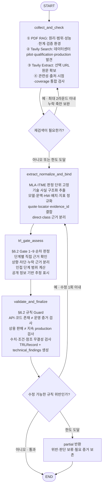

# 기술조사 에이전트 구현 결정·변경·테스트 기록

> 대상 구현: `agents/technical/`
>
> 이 문서는 기존 RAG 설계서와 실제 구현의 차이, 사용자와 합의한 결정, 테스트 결과를 지속적으로 기록하는 단일 작업 일지다. 앞으로 기술조사 에이전트와 관련해 합의하거나 검증한 내용은 이 문서에 누적한다.

## 1. 문서 운영 규칙

- 기존 설계와 달라지는 사항은 구현 전에 이 문서에 기록한다.
- 확정되지 않은 항목은 임의로 코드에 고정하지 않고 `결정 대기`로 남긴다.
- 결정 항목에는 날짜, 선택지, 최종 결정, 근거, 코드 영향 범위를 기록한다.
- 테스트 기록에는 실행 명령, API 사용 여부, 입력 fixture, 기대값, 실제 결과를 기록한다.
- 실패한 테스트와 폐기된 접근도 삭제하지 않고 원인과 후속 조치를 남긴다.
- API 키·토큰·비밀값은 이 문서와 로그에 기록하지 않는다.

## 2. 구현 범위

기술조사 에이전트는 사용자가 제공한 6개 PDF로 구성된 고정 기술 코퍼스에서 다음 정보를 추출한다.

- 기술 원리와 아키텍처
- 적용 범위와 전제조건
- 성능 수치와 비교 기준
- 한계와 차단 근거
- 검증 환경
- 공개 정보 기반 TRL 추정

주 평가 대상은 다음과 같다.

- SW: DeepSeek-V2에 구현된 MLA
- HW: ITME 시스템 프로토타입

나머지 문서는 양자화, 오프로딩, CXL 기반 접근의 비교·보조 근거로 사용한다. 보조 문서의 성능 수치를 MLA 또는 ITME 자체 성능으로 잘못 귀속하지 않는다.

기술조사 에이전트는 시장·이해관계자·도메인 평가 결과를 입력받지 않는다. 기술 원문과 고정 코퍼스만 사용하며, 결과는 부모 `AppState`의 `technical_findings`와 `evidence_store`로 반환한다.

## 3. 저장소 배치

기존 프로젝트 규칙에 따라 다음 구조로 구현한다.

```text
agents/technical/
├── __init__.py       # make_node와 의존성 타입만 공개
├── node.py           # AppState 입력 투영, 서브그래프 실행, 부모 State 업데이트 반환
├── subgraph.py       # 기술조사 내부 LangGraph workflow
├── state.py          # TechnicalLocalState
├── models.py         # OpenAI structured output용 Pydantic 모델
├── prompts.py        # 구조화 추출 프롬프트
├── retrieval.py      # BM25 + dense + RRF 검색
├── corpus.py         # PDF 파싱, 청킹, manifest와 index 준비
├── evidence.py       # evidence_id 생성, 근거 검증과 병합
└── trl.py            # TRL Gate 판정

tests/agents/technical/
├── fixtures/
└── test_technical_agent.py

scripts/
└── run_technical.py
```

외부에는 `agents.technical.make_node()`만 공개한다. 다른 에이전트 구현을 직접 import하지 않는다.

## 4. 기존 설계와 달라지는 사항

### 4.1 질문 생성: LLM 생성에서 고정 영문 템플릿으로 변경

기존 설계:

```text
입력 -> 조사 질문 생성 -> RAG 검색
```

변경 설계:

```text
입력 -> 코드에 고정된 영문 조사 기준과 질의 템플릿 -> RAG 검색
```

고정 조사 기준은 다음 다섯 축이다.

1. `mechanism`
2. `application_scope`
3. `performance`
4. `limitations`
5. `validation_environment`

변경 이유:

- 기술과 원문 문서가 MLA·ITME로 고정되어 있다.
- 실행마다 질문 표현이 달라지는 것을 막아 검색 재현성을 높인다.
- 영어 원문을 대상으로 하므로 검색 질의를 처음부터 영어로 고정할 수 있다.
- 질문 생성용 LLM 호출을 제거한다.

나빠지는 점과 대응:

- 고정 기준에 없는 새로운 쟁점을 자동 발견하기 어렵다.
- 누락 기준이 있으면 재검색 루프에서 해당 기준의 보완 질의만 다시 만든다.

### 4.2 근거 적합성 검사와 충분성 판정을 하나로 통합

기존 설계:

```text
RAG 검색 -> 근거 적합성 검사 -> 근거 충분성 판정
```

변경 설계:

```text
RAG 검색 -> retrieve_and_check
```

`retrieve_and_check`는 한 번에 다음을 수행한다.

- `tech_id`가 기대 기술과 일치하는지 검사
- `chunk_id`, 페이지, locator, 원문 인용문 존재 여부 검사
- 다섯 조사 기준별 coverage 계산
- 누락 기준 계산
- 재검색 여부 결정
- 재시도 한도를 소진했으면 누락 항목을 `gaps`로 기록

관련성 검사와 coverage 판정의 세부 함수는 분리하지만 LangGraph 노드는 하나로 둔다.

### 4.3 구조화 추출·정규화는 합치되, TRL 판정과 검증은 Graph에 분리

기존 설계:

```text
구조화 추출
-> 비교 조건 정규화
-> TRL 추정
-> technical_findings 반환
```

초기 단순화안:

```text
analyze_and_finalize
```

초기에는 구조화 추출·정규화·TRL·반환을 모두 `analyze_and_finalize`에 넣으려 했다. 그러나 이 구조에서는 설계서 §6.2의 다음 핵심 규칙이 Graph 밖에 숨는다.

- 판정 단위를 MLA 구현과 ITME 시스템 프로토타입으로 고정
- 단계별 상향 근거 연결
- 상향을 막는 근거와 missing evidence 분리
- 불확실할 때 단일 숫자가 아니라 인접 범위 사용
- API·프레임워크 코드만으로 TRL 7 이상을 확정하지 않음
- 모든 결과를 공개 정보 기반 추정으로 표시

따라서 초기 2노드 안은 폐기하고 다음처럼 압축한다.

1. `collect_and_check`: 고정 PDF RAG + Tavily 데이터센터 운용 근거 검색·원문 추출 + coverage 검사
2. `extract_normalize_and_bind`: 구조화 추출 + 비교 조건 정규화 + 원문 근거 결합
3. `trl_gate_assess`: §6.2의 판정 단위·Gate 1~9·범위·상향/차단/누락 근거 계산
4. `validate_and_finalize`: TRL 규칙 위반 검사 + `technical_findings` 반환

TRL 내부의 환경 분류, Gate 표 작성, 범위 계산을 각각 Graph 노드로 더 쪼개지 않고 `trl_gate_assess`의 순수 함수들로 둔다. 반면 TRL 결과를 만드는 단계와 그 결과를 독립적으로 검사하는 단계는 분리한다.

### 4.4 언어 라우팅 제거

기존 설계에는 한국어·영어·혼합 질의를 `ascii_ratio`로 분기하는 언어 라우팅이 포함되어 있었다.

기술조사 에이전트에서는 이를 사용하지 않는다.

- 원문 논문은 영어다.
- 검색 기준은 고정되어 있다.
- BM25와 dense 검색 모두 통제된 영문 검색 질의를 사용한다.
- BM25와 dense 결과는 RRF로 결합한다.
- 사용자에게 제시하는 설명과 최종 결과는 한국어로 생성할 수 있지만 검색 질의는 영어로 유지한다.

향후 Pool A에 한국어 원문이 추가될 경우 이 결정을 재검토한다.

### 4.5 변경하지 않는 사항

다음 항목은 기존 설계를 유지한다.

- Pool A는 고정 기술 코퍼스로 관리한다.
- MLA와 ITME 검색은 `tech_id`로 격리한다.
- PDF 파싱은 페이지와 locator를 보존한다.
- 청킹은 우선 `1,200자 / 200자 overlap`을 사용한다.
- 검색은 BM25 + dense + RRF를 사용한다.
- dense embedding 기본 후보는 `BAAI/bge-m3`다.
- reranker는 최초 구현에 포함하지 않는다.
- 재검색은 최대 2라운드까지 허용한다.
- 근거 ID는 URL 또는 문서 ID + locator + 정규화 인용문으로 결정적으로 생성한다.
- 동일 근거는 멱등 병합한다.
- 모든 성능 수치에는 baseline, metric, hardware, model, context와 최대값 여부를 가능한 범위에서 연결한다.
- TRL은 공개 근거의 Gate 충족 여부로 판정하고 `supporting_evidence`, `blocking_evidence`, `missing_evidence`를 함께 반환한다.

## 5. 확정된 기술조사 workflow



Graph에는 검색 재시도, TRL 판정, 독립 Guard 재검토처럼 실행 경로와 결과 신뢰도를 바꾸는 단계만 드러낸다. 세부 환경 분류와 Gate 계산은 일반 Python 함수로 압축한다.

## 6. 노드별 계약

### 6.1 `collect_and_check`

입력:

- `request`
- `selected_tech`
- `corpus_manifest`
- `search_attempt`
- 기존 `candidate_evidence`
- 기존 `missing_criteria`
- 기존 `missing_trl_evidence`

출력:

- `candidate_evidence`
- `coverage`
- `missing_criteria`
- `search_attempt`
- `needs_retry`
- `gaps`
- 검증된 PDF·웹 `candidate_evidence`
- `tavily_search_log`

규칙:

- PDF RAG는 원리·적용 범위·성능·한계·relevant environment를 담당한다.
- Tavily Search API는 데이터센터의 pilot·qualification·상용 배포·지속 production 후보 URL 발견을 담당한다.
- Tavily Extract API는 선택 URL의 실제 원문을 확보하며, 검색 결과의 `content`나 생성형 답변은 최종 근거로 사용하지 않는다.
- 첫 라운드는 전체 고정 질의를 사용하고, 두 번째 라운드부터 누락 기준만 보완 검색한다.
- 웹 질의에는 대상 기술명과 `data center`, `LLM inference serving`, `production deployment`, `pilot`, `customer case study`, `qualification` 조건을 명시한다.
- 검색 결과 snippet은 근거로 사용하지 않고 URL의 원문을 다시 열어 locator와 quote를 확보한다.
- 공식 운영자·고객 사례, 공식 제품/서비스 문서, 논문 원문을 우선하고 재보도·검색 요약만으로 TRL을 올리지 않는다.
- 기준일 이후 자료와 온디바이스·엣지·학습 전용 자료를 제외한다.
- 검색 결과 전체를 State에 저장하지 않고 검증된 짧은 근거와 식별자만 저장한다.
- PDF, FAISS, BM25, embedding model 객체는 State에 넣지 않는다.

Tavily 기본 설정:

- 환경변수: `TAVILY_API_KEY`
- Search: `search_depth="advanced"`, `chunks_per_source=3`, `max_results=5`, `include_answer=False`, `include_published_date=True`
- Extract: `extract_depth="advanced"`, `format="markdown"`, 관련 query와 `chunks_per_source=3`
- 검색 기준일 이후 자료는 제외하고 검색·추출 request id, URL, 발행일, 실패 URL을 로그에 남긴다.
- 기술별 첫 라운드 Tavily 질의는 최대 2개로 제한한다. 두 번째 라운드는 누락된 TRL 축만 보완한다.
- Extract 결과의 `raw_content`를 로컬 snapshot으로 저장하고 content hash와 chunk locator를 만들어 인용을 검증한다.

### 6.2 `extract_normalize_and_bind`

입력:

- `candidate_evidence`
- `coverage`
- `missing_criteria`
- `gaps`
- `selected_tech`
- 조사 기준일

출력:

- `technical_records`
- `normalized_metrics`
- `trl_observations`
- `evidence_store`
- `reference_violations`

규칙:

- OpenAI API structured output으로 기술별 레코드를 생성한다.
- MLA와 ITME는 별도 레코드로 추출한다.
- 비교 조건과 검증 환경·통합 수준을 구조화하지만 TRL 숫자는 생성하지 않는다.
- 대상 기술 직접 근거와 KIVI·TurboQuant·InfiniGen·CXL-PNM의 기술군 보조 근거를 분리한다.
- 존재하는 chunk, locator, 원문 quote에 결합되지 않은 주장은 다음 단계로 넘기지 않는다.
- 확인할 수 없는 값은 추정하지 않고 `None`, `unknown`, `missing_evidence`로 남긴다.

### 6.3 `trl_gate_assess`

입력:

- `trl_observations`
- 검증된 `evidence_store`
- `selected_tech`

출력:

- 기술별 `TRLRecord` 초안
- 단계별 Gate trace
- `trl_rule_notes`

규칙:

- 판정 단위를 `DeepSeek-V2에 구현된 MLA`와 `ITME 시스템 프로토타입`으로 고정한다.
- 문서 형식, FPGA 사용, 제품명, API 지원을 TRL 숫자에 기계적으로 매핑하지 않는다.
- Gate 1부터 순차 판정하며 각 상향 단계에 직접 evidence_id를 요구한다.
- 직접 충족된 최고 단계와 다음 단계의 부분 근거가 동시에 있을 때만 인접 범위로 표시한다.
- `supporting_evidence`, `blocking_evidence`, `missing_evidence`를 분리한다.
- `estimated_from_public_info`는 항상 `True`다.
- 고정 PDF만으로 판단하지 않고, `collect_and_check`가 검증한 데이터센터 웹 원문을 TRL 7~9 입력으로 함께 사용한다.
- API 제공·GitHub 코드·프레임워크 지원·제품 판매만으로 TRL 7 이상을 충족 처리하지 않는다.
- TRL 7은 실제 또는 production-equivalent 데이터센터 pilot, TRL 8은 최종형 통합·qualification, TRL 9는 실제 production의 지속 성공 운용을 직접 말하는 근거가 필요하다.
- 운영자·고객 원문 없이 벤더 발표만 있으면 최대 `announcement`로 두고, 상향에 필요한 증거를 `missing_evidence`에 적는다.
- 검색으로도 확인하지 못하면 “상용되지 않음”이 아니라 “공개 근거에서 상용·운용 여부 확인 불가”로 기록한다.
- 논문 근거의 `evidence_level`은 최대 `pilot`이다.

### 6.4 `validate_and_finalize`

입력:

- 기술 레코드와 정규화 수치
- TRLRecord 초안과 Gate trace
- 검증된 `evidence_store`

출력:

- `technical_findings`
- 기술조사 관점 품질 로그
- 수정 여부와 `partial` 사유

규칙:

- §6.2의 판정 단위, 단계별 직접 근거, 범위, 공개 정보 추정 표시를 결정적으로 검사한다.
- TRL 7~9가 검증된 데이터센터 운영 원문 없이 확정돼 있으면 규칙 위반으로 차단한다.
- API·코드 존재, 제품 판매, 벤더의 미래형 발표를 operational pilot 또는 production 증거로 사용하면 차단한다.
- 수정 가능한 구조화 오류는 `extract_normalize_and_bind`로 최대 1회 되돌린다.
- 남은 위반이나 확인 불가 항목은 숨기지 않고 `partial`, `gaps`, `limitations`로 반환한다.

## 7. 원문 수치 검증 규칙

### 7.1 MLA

- 93.3% 감소는 DeepSeek 67B 대비 DeepSeek-V2 전체 배치 비교 조건을 붙인다.
- 5.76배는 최대 생성 처리량이며 8xH800, 실서비스 길이 분포, FP8 weight, 평균 6-bit KV quantization 조건을 보존한다.
- 42.5% 훈련비 절감은 MLA 단독 효과로 사용하지 않는다.
- HellaSwag 결과를 MLA 자체의 반증으로 사용하지 않는다.

### 7.2 ITME

- 1.80배는 NVMe-oF 기반 disaggregated storage 대비 throughput이다.
- 1.81배는 Recompute 대비 turn 5의 TTFT speedup이다.
- 35.7%는 CPU-offload 대비 extended turns의 최대 throughput 향상이다.
- 3.02배는 Ideal GPU memory 상한이며 ITME 성능으로 보고하지 않는다.
- 서로 다른 baseline의 수치를 합산·평균하지 않는다.

이 규칙은 프롬프트만으로 강제하지 않고 `validate_metric_records()`에서 결정적으로 검사한다.

## 8. 구현 전 결정 대기 항목

### P1. OpenAI 호출 계층과 기본 모델

상태: `결정 완료 (2026-09-22)`

선택지:

1. OpenAI Python SDK의 Responses API를 직접 사용
2. `langchain-openai`의 `ChatOpenAI.with_structured_output()` 사용

권장: **1번, OpenAI Responses API 직접 사용**

이유:

- 기술조사 에이전트의 LLM 단계는 `analyze_and_finalize` 한 곳뿐이다.
- 저장소의 이해관계자 에이전트에서 OpenAI Responses API 실제 호출이 이미 검증됐다.
- OpenAI structured output과 실제 response metadata를 직접 기록할 수 있다.
- LangGraph와 LLM 호출 계층을 분리할 수 있다.

최종 결정:

- 호출 계층: OpenAI Python SDK의 Responses API 직접 사용
- 기본 모델: `gpt-4.1-nano`
- 모델 설정: `OPENAI_MODEL` 환경변수가 있으면 그 값을 사용하고, 없으면 `gpt-4.1-nano`로 fallback
- 출력 형식: Responses API Structured Outputs + Pydantic 스키마
- 추론 설정: 별도 reasoning 설정을 사용하지 않음
- 재현성을 위해 샘플링 설정은 가능한 한 결정적으로 구성
- 최대 출력 토큰은 구조화 레코드 크기를 기준으로 구현 시 보수적인 기본값을 두고 환경변수로 조정 가능하게 함

비고:

- 사용자가 말한 “gpt-4 nano”는 OpenAI 공식 API 모델 ID인 `gpt-4.1-nano`로 해석했다.
- 고정 snapshot ID가 아니라 alias인 `gpt-4.1-nano`를 사용한다.
- OpenAI 공식 모델 문서에서 Responses API와 Structured Outputs 지원을 확인했다.

### P2. D1·D3 원문 확보 방식

상태: `결정 완료 (2026-09-22)`

현재 저장소 `data/`에는 원문 PDF가 없다.

선택지:

1. 실행 스크립트가 arXiv에서 원문을 다운로드하고 체크섬을 기록
2. 사용자가 PDF 경로를 명시하고 코드는 로컬 파일만 사용
3. 공식 URL 다운로드와 사용자 지정 로컬 경로를 모두 지원

권장: **3번**

- 기본 manifest에는 공식 arXiv URL을 둔다.
- 동일 revision의 로컬 파일이 있으면 로컬 파일을 우선한다.
- 다운로드는 명시적 준비 명령에서만 수행하고 에이전트 실행 중에는 하지 않는다.
- 실제 실행은 고정된 로컬 snapshot과 SHA-256을 사용한다.

최종 결정:

- 사용자가 제공한 로컬 PDF 6개를 고정 코퍼스로 사용한다.
- 에이전트 실행 중 네트워크 다운로드를 하지 않는다.
- 원문은 `data/technical/sources/`에 원래 arXiv 파일명으로 보관한다.
- manifest에 arXiv ID, 문서 역할, 기술 계열, revision, SHA-256을 기록한다.
- 파일이 없거나 체크섬이 다르면 조용히 재다운로드하지 않고 명시적인 준비 오류를 반환한다.

고정 코퍼스:

| 파일 | 문서 | 역할 | 분류 | SHA-256 |
|---|---|---|---|---|
| `2402.02750v2.pdf` | KIVI: A Tuning-Free Asymmetric 2bit Quantization for KV Cache | 보조 비교 근거 | SW / KV 양자화 | `df31ef32d71bfb280c533c5db8220cadf5ef42076bf45d82ba4c8da8e50ea5f4` |
| `2405.04434v5.pdf` | DeepSeek-V2: A Strong, Economical, and Efficient Mixture-of-Experts Language Model | MLA 주 근거 | SW / MLA | `f149f9c09aa8b46ce6a740a255a99b7cc2317ac5b065989339919b7e6c329c9b` |
| `2406.19707v1.pdf` | InfiniGen: Efficient Generative Inference of Large Language Models with Dynamic KV Cache Management | 보조 비교 근거 | HW·시스템 / KV 오프로딩 | `267d689a1ded953f076eb93976c0ebeac1ad02029f1f7c9dd1c947aa05d7cb5f` |
| `2504.19874v1.pdf` | TurboQuant: Online Vector Quantization with Near-optimal Distortion Rate | 보조 비교 근거 | SW / 벡터·KV 양자화 | `431eb13926e10491f5fbd0bebd0813c51bd6c1e884426a1500c5db640b2997ab` |
| `2511.00321v1.pdf` | Scalable Processing-Near-Memory for 1M-Token LLM Inference: CXL-Enabled KV-Cache Management Beyond GPU Limits | 보조 비교 근거 | HW / CXL-PNM | `794adce50555cc340e9067e927d1822e4c6d3eff0ae39e2c87baa94f787d1061` |
| `2606.12556v2.pdf` | ITME: Inference Tiered Memory Expansion with Disaggregated CXL-Hybrid Memories | ITME 주 근거 | HW / CXL-hybrid tiered memory | `c8f29ee52bfaef00bd2b26bf2e71e49eda394d6e85b7fc9975fa5fd9a24a94d7` |

### P3. BGE-M3 실행 장치와 모델 캐시

상태: `결정 완료 (2026-09-22)`

결정 항목:

- CPU만 지원할지, Apple Silicon MPS 또는 CUDA 자동 선택을 허용할지
- embedding 모델 캐시 위치
- 테스트에서는 실제 embedding 대신 결정적 fake embedding을 사용할지

권장:

- 실제 실행은 `auto`로 두되 manifest에 실제 device를 기록한다.
- 오프라인 단위 테스트는 fake retriever를 주입해 모델 다운로드 없이 실행한다.
- 실제 BGE-M3 검색은 별도의 integration test로 분리한다.

최종 결정:

- 실제 BGE-M3 실행 장치는 `CUDA -> MPS -> CPU` 우선순위로 자동 선택한다.
- 자동 선택 결과와 embedding 모델명은 실행 로그와 검색 manifest에 기록한다.
- `EMBEDDING_DEVICE` 환경변수로 `cuda`, `mps`, `cpu`를 명시적으로 고정할 수 있게 한다.
- 일반 단위 테스트는 다운로드와 장치 의존성이 없는 결정적 fake embedding/retriever를 주입한다.
- 실제 BGE-M3 모델을 사용하는 검증은 `integration` 표식이 있는 별도 테스트로 분리한다.
- 모델 캐시는 라이브러리 기본 캐시를 사용하되, `HF_HOME` 등 표준 환경변수를 존중한다. 캐시 경로를 코드에 하드코딩하지 않는다.

### P4. OpenAI 실API 테스트 비용 범위

상태: `결정 완료 (2026-09-22)`

선택지:

1. 구현 완료 전까지 API 없는 fixture 테스트만 실행
2. 최소 입력으로 OpenAI 구조화 호출 1회 수행
3. D1·D3 전체 근거로 end-to-end 실API 실행

권장 순서: **1 -> 2 -> 3**

각 단계는 이전 단계가 통과한 뒤 사용자의 승인을 받고 실행한다.

최종 결정:

- 비용 없는 fixture·단위 테스트를 먼저 실행한다.
- 최소 입력 OpenAI 구조화 호출 1회는 실행 직전에 별도 승인을 받는다.
- 전체 PDF end-to-end 실API 실행도 별도 승인을 받은 뒤 수행한다.

### P5. 데이터센터 운용·상용화 보강 검색 제공자

상태: `결정 완료 (2026-09-22)`

최종 결정:

- 외부 웹 검색은 Tavily API를 사용한다.
- Tavily Search로 후보 URL을 찾고 Tavily Extract로 선택 URL의 원문을 확보한다.
- `gpt-4.1-nano`는 PDF·웹 원문의 구조화 추출에만 사용하며 웹 검색 제공자로 사용하지 않는다.
- Tavily 검색 결과의 answer/snippet만으로 주장이나 TRL을 만들지 않는다.
- 데이터센터 LLM inference serving 범위에 해당하는 자료만 채택한다.

## 9. 테스트 계획

### 9.1 API 없이 수행할 테스트

- 고정 질의 템플릿 생성
- 영문 질의만 retriever에 전달되는지 검사
- `tech_id` 검색 격리
- coverage와 missing criteria 계산
- 최대 2라운드 제한
- 근거 ID의 결정성
- evidence merge의 멱등성
- MLA·ITME 수치와 baseline 검사
- TRL Gate 단위 테스트
- `technical_findings`가 `PerspectiveFindings` 계약을 만족하는지 검사
- `make_node()`가 부모 State의 자기 소유 키만 반환하는지 검사

### 9.2 실제 모델·API가 필요한 테스트

- BGE-M3 + BM25 + RRF 검색 결과 재현
- OpenAI structured output 스키마 준수
- 근거 ID가 존재하지 않는 주장을 제거하거나 강등하는지 검사
- D1·D3 전체 end-to-end 실행
- Parent `AppState`에 `technical_findings`와 `evidence_store`가 실제로 채워지는지 검사

## 9.3 구현·테스트 기록

### 2026-09-22 — 1차 구현

- `agents/technical/`에 4노드 LangGraph와 부모 `make_node()` 어댑터를 구현했다.
- OpenAI 모델 기본값은 `gpt-4.1-nano`, 웹 제공자는 Tavily Search + Extract로 고정했다.
- 공개된 비밀값을 코드·문서·명령행·테스트 fixture에 저장하지 않았다.
- 고정 입력을 `data/technical/default_input.json`과 `config.py` 양쪽에 동일하게 기록했다.
- 부모 노드 최상위 출력 키는 `technical_findings`, `evidence_store` 두 개로 고정했다.
- 중첩 출력 필드까지 `data/technical/output_contract.json`과 코드 검증 함수로 고정했다.
- API 없는 단위 테스트 8개를 실행했고 모두 통과했다.
- 실제 PDF 6개의 manifest SHA-256과 페이지 수를 검증했으며 525개 locator 보존 chunk를 생성했다.
- OpenAI SDK의 `responses.parse(text_format=...)`와 Tavily SDK의 `search`/`extract` 호출 인자를 설치된 SDK에서 점검했다.

실행한 검증:

```text
8 passed
PDF 6개 검증 성공
chunk 525개 생성 (SW 253, HW 272)
모든 chunk의 locator와 text 존재
실제 PDF BM25 오프라인 통합 실행: complete, 레코드 12개, claim 12개, 결합 근거 5개
전체 저장소 테스트: 48 passed
```

실제 OpenAI/Tavily 호출은 키를 명령이나 로그에 노출하지 않기 위해 수행하지 않았다. 사용자가 로컬 `.env`에 키를 저장한 뒤 `python -m scripts.run_technical`로 별도 수행한다.

## 10. 대화·의사결정 기록

### 2026-09-22

- 사용자는 기존 기술조사 그래프가 지나치게 세분화됐다고 판단했다.
- 다음 변경만 반영하기로 했다.
  - 동적 조사 질문 생성 제거, 고정 영문 질의 사용
  - 근거 적합성과 충분성 검사를 통합
  - 구조화 추출과 비교 조건 정규화를 통합
  - 언어 라우팅 제거
- 추가 논의에서 구조화 추출·정규화·TRL 추정·최종 반환을 `analyze_and_finalize` 하나의 Graph 노드로 합치는 2노드 안을 만들었다.
- 이후 설계서 §6.2의 판정 단위 고정, 단계별 상향 근거, 차단·누락 근거, 범위, 독립 Guard를 한 노드 안에서 감사하기 어렵다는 문제가 확인되어 2노드 안을 폐기했다.
- 확정 workflow는 `retrieve_and_check`, `extract_normalize_and_bind`, `trl_gate_assess`, `validate_and_finalize`의 4개 업무 노드로 구성한다.
- TRL의 세부 환경 분류·Gate 표·범위 계산은 `trl_gate_assess` 내부 순수 함수로 압축하고, 결과 검증만 별도 Guard 노드로 둔다.
- 고정 PDF Pool A만으로 실제 상용화·지속 운용 여부를 확인하기 어렵다는 문제가 제기됐다.
- 이를 보완하기 위해 기술조사 에이전트에 데이터센터 운용·상용화 근거 전용 웹 검색 경로를 추가했다.
- 웹 제공자는 Tavily API로 확정했으며, Tavily Search로 후보 URL을 발견하고 Tavily Extract로 원문을 확보한다.
- 웹 검색으로도 직접 운영 근거가 확인되지 않으면 “미상용”으로 단정하지 않고 `missing_evidence`에 공개 근거 확인 불가로 남긴다.
- OpenAI API를 사용한다.
- OpenAI 호출 계층은 Python SDK의 Responses API 직접 사용으로 확정했다.
- 기본 모델은 사용자가 지정한 “gpt-4 nano”를 공식 API ID `gpt-4.1-nano`로 반영한다.
- `OPENAI_MODEL` 환경변수로 기본 모델을 덮어쓸 수 있게 한다.
- 사용자가 제공한 로컬 PDF 6개를 고정 코퍼스로 사용하기로 했다.
- MLA 주 근거는 `2405.04434v5.pdf`, ITME 주 근거는 `2606.12556v2.pdf`로 지정한다.
- 나머지 4개 문서는 비교·보조 근거로만 사용하며 주 평가 기술의 성능으로 잘못 귀속하지 않는다.
- 에이전트 실행 중 원문을 자동 다운로드하지 않으며 파일 누락·체크섬 불일치는 준비 오류로 처리한다.
- BGE-M3 실행 장치는 `CUDA -> MPS -> CPU` 순서로 자동 선택한다.
- 단위 테스트는 결정적 fake embedding을 사용하고, 실제 BGE-M3 검증은 별도 integration test로 분리한다.
- 실행 코드 작성 전 중요한 사안을 우선순위대로 사용자에게 확인한다.

## 11. 테스트 실행 기록

아직 기술조사 에이전트 코드를 작성하지 않았으므로 실행 기록이 없다.

향후 다음 형식으로 추가한다.

```text
### YYYY-MM-DD / 테스트 이름

- 목적:
- 실행 명령:
- API 사용 여부:
- 입력 또는 fixture:
- 기대 결과:
- 실제 결과:
- 상태: passed / failed / partial / blocked
- 발견 사항:
- 후속 조치:
```
